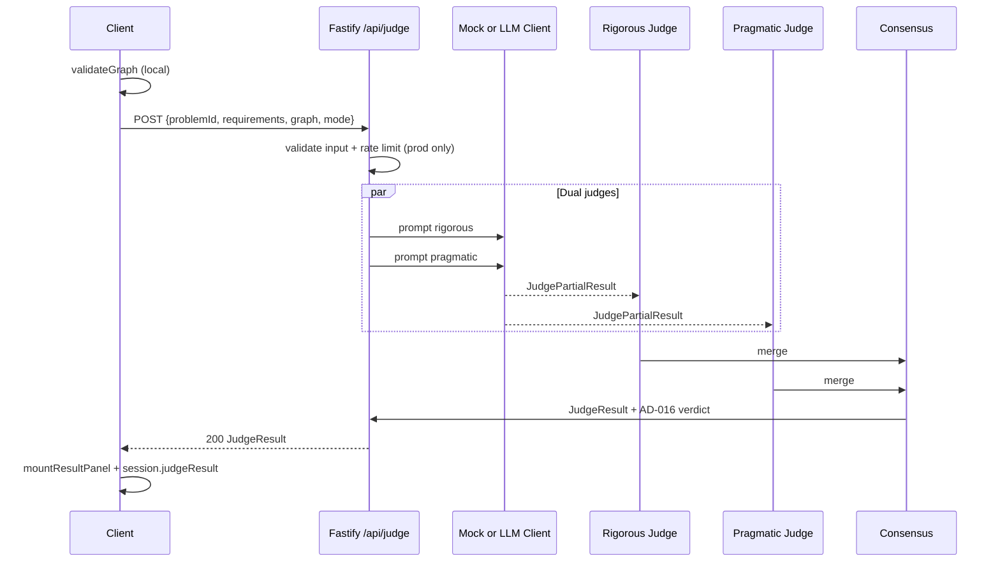
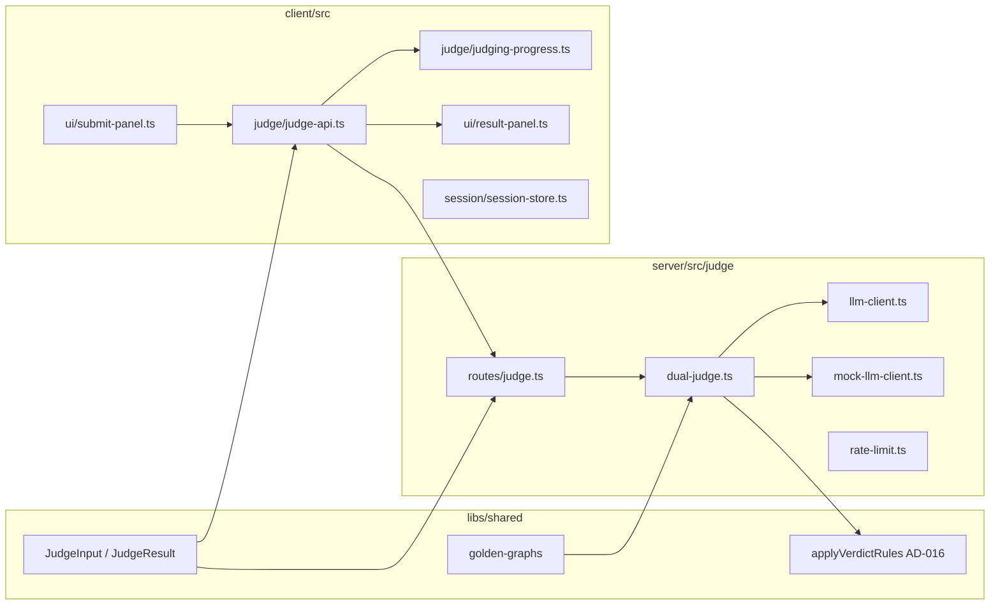

# AI Judge — Design

**Spec:** `.specs/features/ai-judge/spec.md`  
**Context:** `.specs/features/ai-judge/context.md`  
**Parent design:** `.specs/features/product/design.md`  
**Status:** Approved — 2026-07-27

---

## Architecture Overview

O client valida o grafo localmente (já existe) e chama `POST /api/judge`. O server orquestra dois juízes LLM em paralelo, funde os resultados em consenso, aplica regras AD-016, e retorna `JudgeResult` tipado. Em CI/dev sem `LLM_API_KEY`, um mock client retorna fixtures determinísticos.





---

## Code Reuse Analysis

### Existing Components to Leverage

| Component | Location | How to Use |
| --------- | -------- | ---------- |
| `validateGraph` | `libs/shared/src/validation/validate-graph.ts` | Client já usa no submit; server re-valida grafo não-vazio |
| `getProblem` | `libs/shared/src/problems/index.ts` | Server carrega briefing/constraints para prompts |
| `mountSubmitPanel` | `client/src/ui/submit-panel.ts` | Estender para chamar API após validação local |
| `mountPhaseNavigation` | `client/src/session/phase-navigation.ts` | Wire result panel na fase `result` |
| `ExperienceLevel` | `client/src/storage/preferences.ts` | Default do toggle "Modo iniciante" |
| `window.__GAME_STATE__` | `client/src/test-hook.ts` | Expor `judgeResult`, `judgingPhase` para testes |
| Fastify health routes | `server/src/routes/health.ts` | Padrão para registrar `judge` routes |
| Vite proxy `/api` | `client/vite.config.ts` | Já aponta para `:3000` — sem mudança |

### Integration Points

| System | Integration Method |
| ------ | ------------------ |
| Session store | Adicionar `judgeResult?: JudgeResult` + `setJudgeResult()` |
| Submit flow | `onSubmitSuccess` → async judge → `advancePhase('result')` |
| Product design types | Mover `JudgeResult` de design.md para `libs/shared` como source of truth |

---

## Components

### Shared — Judge Schema (`libs/shared/src/schema/judge.ts`)

- **Purpose:** Tipos compartilhados client/server para input e output do julgamento
- **Location:** `libs/shared/src/schema/judge.ts`
- **Interfaces:**
  - `JudgeInput` — `{ problemId, requirements, graph, mode }`
  - `JudgeResult` — verdict, score, feedback arrays, requirementCoverage, judgeDebate, summary
  - `JudgePartialResult` — resposta de um juiz antes do consenso
  - `ReqCoverageItem` — `{ requirement, type, status, explanation }`
  - `FeedbackItem` — title, explanation, howToImprove, whyItMatters, severity?
- **Dependencies:** `ArchitectureGraph`, `GameMode`
- **Reuses:** Shape definido em `product/design.md`

### Shared — Verdict Rules (`libs/shared/src/judge/apply-verdict.ts`)

- **Purpose:** Aplicar AD-016 deterministicamente a score + criticalIssues
- **Location:** `libs/shared/src/judge/apply-verdict.ts`
- **Interfaces:**
  - `applyVerdictRules(score: number, issues: FeedbackItem[]): Verdict`
  - `isBlocker(issue: FeedbackItem): boolean`
- **Dependencies:** `JudgeResult` types
- **Reuses:** AD-016 em STATE.md

### Shared — Golden Graphs (`libs/shared/src/judge/golden-graphs.ts`)

- **Purpose:** 3 grafos fixture (good, medium, bad) para URL Shortener
- **Location:** `libs/shared/src/judge/golden-graphs.ts`
- **Interfaces:** `getGoldenGraph(tier: 'good' | 'medium' | 'bad'): ArchitectureGraph`
- **Reuses:** `ArchitectureGraph`, component types do catalog

### Server — LLM Client (`server/src/judge/llm-client.ts`)

- **Purpose:** Adapter OpenAI-compatible (chat completions, JSON mode)
- **Interfaces:**
  - `createLlmClient(config: LlmConfig): LlmClient`
  - `completeJson<T>(prompt: JudgePrompt): Promise<T>`
- **Env:** `LLM_API_KEY`, `LLM_BASE_URL` (default `https://api.openai.com/v1`), `LLM_MODEL` (default `gpt-4o-mini`)
- **Reuses:** fetch nativo Node 20+

### Server — Mock LLM Client (`server/src/judge/mock-llm-client.ts`)

- **Purpose:** Respostas determinísticas por hash do grafo ou tier fixture
- **Interfaces:** Mesma interface que `LlmClient`
- **Behavior:** Ativado quando `LLM_API_KEY` ausente ou `JUDGE_USE_MOCK=true`

### Server — Dual Judge (`server/src/judge/dual-judge.ts`)

- **Purpose:** Orquestrar juízes rigoroso + pragmático → consenso
- **Interfaces:**
  - `judgeSubmission(input: JudgeInput, client: LlmClient): Promise<JudgeResult>`
  - `buildRigorousPrompt(problem, input): string`
  - `buildPragmaticPrompt(problem, input): string`
  - `mergeConsensus(rigorous, pragmatic): JudgeResult`
- **Dependencies:** `getProblem`, `applyVerdictRules`, LLM client
- **Reuses:** AD-006 debate structure

### Server — Rate Limiter (`server/src/judge/rate-limit.ts`)

- **Purpose:** 20 req/IP/hora em produção (`NODE_ENV=production`)
- **Interfaces:** `checkRateLimit(ip: string): { allowed: boolean; retryAfterSec?: number }`
- **Reuses:** Map in-memory (sem Redis no MVP)

### Server — Judge Route (`server/src/routes/judge.ts`)

- **Purpose:** `POST /api/judge` HTTP handler
- **Interfaces:** Fastify route plugin
- **Validation:** Zod ou manual — problemId exists, graph schema, requirements arrays
- **Errors:** 400 invalid, 429 rate limit, 503 no API key (prod only), 502 LLM parse fail, 504 timeout

### Client — Judge API (`client/src/judge/judge-api.ts`)

- **Purpose:** Fetch wrapper com timeout, retry payload cache, step callbacks
- **Interfaces:**
  - `submitForJudging(input: JudgeInput, onProgress: (step: JudgingStep) => void): Promise<JudgeResult>`
- **Dependencies:** shared types
- **Reuses:** Vite proxy `/api`

### Client — Judging Progress (`client/src/judge/judging-progress.ts`)

- **Purpose:** Overlay DOM com 4 etapas de progresso
- **Interfaces:** `mountJudgingProgress(container): { show, hide, setStep }`
- **Reuses:** Estilo glassmorphism dos painéis existentes

### Client — Result Panel (`client/src/ui/result-panel.ts`)

- **Purpose:** UI de resultado com camadas iniciante/técnico
- **Interfaces:**
  - `mountResultPanel(container, result, options): HTMLElement`
  - `options: { beginnerMode: boolean; onToggleBeginner: (v: boolean) => void }`
- **Sections:** verdict badge, score, summary, strengths, criticalIssues, improvements, requirementCoverage, expandable debate
- **Reuses:** Padrão DOM de `briefing-panel.ts`, `requirements-panel.ts`

### Client — Session + Test Hook updates

- **Purpose:** Persistir `judgeResult` na sessão e expor no `__GAME_STATE__`
- **Location:** `session-store.ts`, `test-hook.ts`, `phase-navigation.ts`
- **Interfaces:** `setJudgeResult`, `getJudgeResult`, `judgingStep` no game state

---

## Data Models

### JudgeInput

```typescript
interface JudgeInput {
  problemId: string;
  requirements: {
    functional: string[];
    nonFunctional: string[];
  };
  graph: ArchitectureGraph;
  mode: 'study' | 'speedrun';
}
```

### JudgeResult

```typescript
type Verdict = 'PASS' | 'PARTIAL' | 'FAIL';

interface JudgeResult {
  verdict: Verdict;
  score: number; // 0-100
  summary: string; // 2-3 frases para camada iniciante
  nextStep: string; // próximo passo sugerido
  strengths: FeedbackItem[];
  criticalIssues: FeedbackItem[];
  improvements: FeedbackItem[];
  requirementCoverage: ReqCoverageItem[];
  judgeDebate: {
    rigorous: string;
    pragmatic: string;
    consensus: string;
  };
}

interface FeedbackItem {
  title: string;
  explanation: string;
  howToImprove: string;
  whyItMatters: string;
  severity?: 'blocker' | 'major' | 'minor';
  relatedComponents?: string[];
}

interface ReqCoverageItem {
  requirement: string;
  type: 'functional' | 'nonFunctional';
  status: 'covered' | 'partial' | 'missing';
  explanation: string;
}
```

### Session extension

```typescript
interface Session {
  // ...existing fields
  judgeResult?: JudgeResult;
}
```

---

## Error Handling Strategy

| Error Scenario | Handling | User Impact |
| -------------- | -------- | ----------- |
| Empty graph | Client `validateGraph` — no API call | Mensagem "Adicione pelo menos um componente" |
| Unknown problemId | Server 400 | "Problema não encontrado" |
| LLM timeout (>60s) | AbortController + 504 | "Julgamento demorou demais" + retry |
| LLM JSON malformed | 1 repair retry, then 502 | "Erro ao processar resposta" + retry |
| No LLM_API_KEY in prod | 503 | "Serviço de julgamento indisponível" |
| Rate limit exceeded | 429 + Retry-After | "Limite atingido, tente em X min" |
| Network offline | fetch throws | "Sem conexão" + retry |

---

## Risks & Concerns

| Concern | Location | Impact | Mitigation |
| ------- | -------- | ------ | ---------- |
| Submit panel é síncrono hoje | `submit-panel.ts` | Precisa refactor async | T7: extrair judge call para `judge-api.ts`; submit dispara async flow |
| Session não guarda judgeResult | `session-store.ts` | Result phase perde dados ao navegar | T6: `setJudgeResult` + sync `__GAME_STATE__` |
| Server só tem health route | `server/src/main.ts` | Greenfield judge module | T3–T5 incremental com testes |
| LLM non-determinism | external | Golden tests flaky | Mock client obrigatório em CI; fixtures com vereditos fixos |
| Long judge latency | 15–45s | UX feels frozen | Step progress overlay (context decision) |
| experienceLevel not on Session after reload | preferences vs session | Wrong beginner default | Read `session.experienceLevel` set at createSession |

---

## Tech Decisions

| Decision | Choice | Rationale |
| -------- | ------ | --------- |
| JSON mode for LLM | Structured output via prompt + `response_format: json_object` when supported | Parseável; fallback regex extract |
| Parallel judges | `Promise.all` rigorous + pragmatic | Menor latência |
| Mock activation | `!LLM_API_KEY \|\| JUDGE_USE_MOCK=true` | CI sem secrets; dev sem custo |
| Rate limit scope | Prod only (`NODE_ENV=production`) | User decision in discuss |
| Verdict computation | Server-side `applyVerdictRules` after LLM | AD-016 enforced deterministically, not left to LLM |
| No DB persistence | Ephemeral session | Out of scope Fase 2 |

---

## Prompt Strategy (high-level)

Cada juiz recebe:
1. System: papel (rigoroso vs pragmático) + formato JSON esperado + rubrica URL Shortener
2. User: briefing, metrics, constraints, requirements declarados, grafo serializado (nodes + edges com labels)

Output parcial: score sugerido, lists de feedback, requirementCoverage, debate paragraph.

Consensus step: merge lists (dedupe por title), take min score for conservative verdict, combine debate strings, then `applyVerdictRules`.
