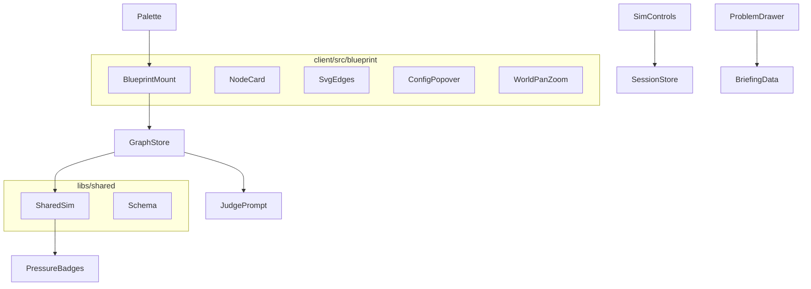

# Blueprint 2D Canvas — Design

**Spec:** `.specs/features/blueprint-2d-canvas/spec.md`  
**Context:** `.specs/features/blueprint-2d-canvas/context.md`  
**Status:** Approved  
**Approach:** DOM node cards + SVG edges + shared sim engine (AD-018/019/020)

---

## Architecture Overview



Session canvas **does not** use Three.js. `client/src/scene/*` remains in tree until final cleanup task but is unwired from `main` / phase-navigation.

---

## Data model

```ts
export type PressureLevel = 'ok' | 'warn' | 'hot';

export interface Vec2 { x: number; y: number }

export interface CacheConfig { kind: 'cache'; hitRate: number } // 0–100
export interface CdnConfig { kind: 'cdn'; hitRate: number }
export type PartitioningStrategy = 'hash' | 'range' | 'geographic' | 'list'
export interface SqlDbConfig {
  kind: 'sql_db'
  shardCount: number       // 1–256
  partitioningStrategy: PartitioningStrategy
  partitionKey?: string
  keySkew: number          // 0–100
}
export type ComponentConfig = CacheConfig | CdnConfig | SqlDbConfig

export interface ComponentNode {
  id: string
  type: ComponentType
  label: string
  position: Vec2 & { z?: number } // z ignored / 0
  replicas: number                // ≥1
  implementationNotes?: string
  note?: string                   // legacy read fallback
  config?: ComponentConfig
}

export interface SimulationSettings {
  running: boolean
  speed: number      // 1–10, default 1
  traffic: number    // 1–10, default 1
  readRatio: number  // 0–100, default 80
}

export interface ArchitectureGraph {
  nodes: ComponentNode[]
  edges: ConnectionEdge[]
  simulation?: SimulationSettings
}
```

**Defaults helpers:** `normalizeNode`, `defaultSimulation()`, `defaultConfigForType(type)`.

---

## Simulation formulas (AD-020)

Pure functions in `libs/shared/src/simulation/`:

| Symbol | Definition |
| ------ | ---------- |
| `BASE_LOAD` | 10 |
| `edgeReadWeight(from,to)` | Heurística: paths to cache/cdn/sql via app → read-biased; writes → sql direct; default mixed 0.5 |
| `edgeLoad` | `BASE_LOAD × traffic × (readRatio/100 × w + (1−readRatio/100) × (1−w))` |
| `capacityPerReplica(type)` | client 50, edge/traffic 40, app_server 15, cache/cdn 30, sql/nosql 12, worker 10, default 20 |
| `nodeCapacity` | `replicas × capacityPerReplica × modifiers` |
| Cache/CDN modifier | n/a on self; **downstream DB load** *= `(1 − hitRate/100)` when edge app→cache→db or edge→cdn |
| SQL modifier | `× shardCount^0.5 × (1 − keySkew/100 × 0.5)` |
| `nodeLoad` | Sum of incoming edge loads (after cache attenuation) |
| `pressure` | ratio = load/capacity; `<0.7` ok, `<1.0` warn, else hot |

`evaluateSimulation(graph) → { nodes: Record<id, PressureLevel>, hotReadPath: boolean }`

Speed is **not** an input to evaluateSimulation.

---

## Client components

| Component | Path | Role |
| --------- | ---- | ---- |
| `mountBlueprintCanvas` | `client/src/blueprint/blueprint-canvas.ts` | Root: world, SVG layer, drop target, pan/zoom |
| `createNodeCard` | `client/src/blueprint/node-card.ts` | Card DOM + reps + selection glow |
| `createSvgEdgeLayer` | `client/src/blueprint/svg-edges.ts` | Paths, labels, packet dots when running |
| `mountConfigPopover` | `client/src/blueprint/config-popover.ts` | Tipado + notes |
| `mountBlueprintInteraction` | `client/src/blueprint/interaction.ts` | Drag, link, select, delete |
| `mountSimControls` | `client/src/ui/sim-controls.ts` | Header capsule |
| `mountProblemDrawer` | `client/src/ui/problem-drawer.ts` | PROBLEM slide-out |
| `mountSessionHeader` | `client/src/ui/session-header.ts` | Título + slot sim |

Reuse: palette DnD event, session-store graph sync, phase-navigation mount points, edge-manager domain rules (port to blueprint or thin reimplement in `blueprint/edge-graph.ts`).

---

## Judge

Update `formatGraph` in `server/src/judge/prompts.ts` to dump replicas, config JSON, notes, simulation block.

---

## Risks & Concerns

| Risk | Mitigation |
| ---- | ---------- |
| Large 3D test surface breaks | New blueprint tests; leave old scene tests until unwired; final task skip/remove scene from coverage path |
| Hit-testing vs pan/zoom | Store world coords; convert client→world on pointer |
| Legacy graphs without replicas | `normalizeGraph` on load/submit |
| Fragile phase-navigation | Single mountBlueprint call replacing createCanvasRenderer |

---

## File map (new)

```
libs/shared/src/schema/architecture-graph.ts  # extend
libs/shared/src/schema/normalize-graph.ts     # new
libs/shared/src/simulation/evaluate-simulation.ts
libs/shared/src/simulation/evaluate-simulation.test.ts
client/src/blueprint/*                        # new canvas
client/src/ui/sim-controls.ts
client/src/ui/problem-drawer.ts
client/src/ui/session-header.ts
```
