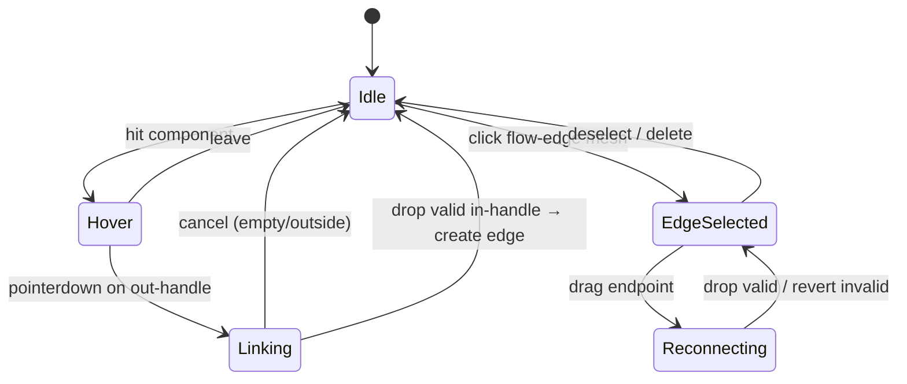
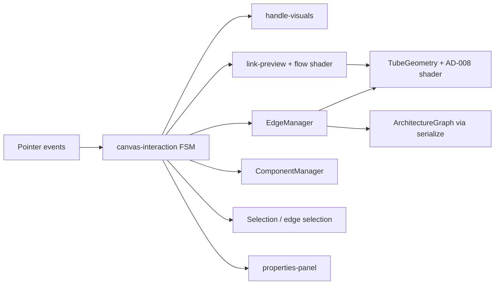

# Canvas Graph DnD — Design

**Spec:** `.specs/features/canvas-graph-dnd/spec.md`  
**Context:** `.specs/features/canvas-graph-dnd/context.md`  
**Status:** Approved — 2026-07-27  
**Approach:** **A — Interaction orchestrator** (confirmed 2026-07-27)

---

## Architecture Overview

Um único orquestrador de ponteiro (`canvas-interaction` + FSM de link) é o dono do raycast e das transições `idle → hover → linking → edgeSelected → reconnecting`. Visuais (handles, preview curvo com shader de fluxo, tubos permanentes) e domínio (`EdgeManager`, `ArchitectureGraph`) permanecem separados; o painel DOM muda de modo componente ↔ aresta.





**Conformidade AD:** AD-002 Three.js · AD-003 DOM UI · AD-004 graph JSON · AD-008 fluxo no tubo · AD-010 `__GAME_STATE__` · AD-013 newbie-friendly (handles no hover).

---

## Code Reuse Analysis

### Existing Components to Leverage

| Component | Location | How to Use |
| --------- | -------- | ---------- |
| `createEdgeManager` | `client/src/scene/edge-manager.ts` | Extend with `reconnectEndpoint`, keep `connect` / `setDirection` / `removeEdge` |
| `createFlowEdge` | `client/src/scene/edges/flow-edge.ts` | Upgrade curve to Bezier; reuse for permanent + preview; `uBidirectional` already exists |
| `createComponentManager` | `client/src/scene/component-manager.ts` | `attachPointerHandlers: false`; body drag only when FSM idle/hover |
| `createSelectionController` | `client/src/scene/selection.ts` | Keep component select/delete; orchestrator owns edge select + Delete routing |
| `mountPropertiesPanel` | `client/src/ui/properties-panel.ts` | Extend sync state for edge mode (invert / bidirectional / delete) |
| `serializeGraph` / session store | `graph-serializer.ts`, `session-store.ts` | Sync after every edge mutation |
| Palette drop | `client/src/ui/palette.ts` | Wire `palette:drop` in orchestrator (CGD-09) |
| Stash WIP | `stash@{0}` `canvas-interaction*` | Reference only; re-implement against this design (do not blindly apply) |

### Integration Points

| System | Integration Method |
| ------ | ------------------ |
| Canvas boot | `main.ts` → `mountCanvasInteraction(renderer, canvas)` after render loop |
| Orbit controls | `controls.enabled = false` while `linking` / `reconnecting` |
| Guided mode | No API change; connect step still valid when edges appear in graph |
| Judge submit | Unchanged — reads `ArchitectureGraph` |

---

## Components

### Canvas Interaction Orchestrator

- **Purpose:** Dono do ponteiro, FSM, sync visual↔grafo, test hooks.
- **Location:** `client/src/scene/canvas-interaction.ts`
- **Interfaces:**
  - `mountCanvasInteraction(renderer, canvas, uiHost): CanvasInteraction`
  - `getInteractionState(): { mode; linkingFromId; hoverComponentId; selectedEdgeId; previewActive }`
  - `syncStoreFromScene(): void` / `loadGraph(graph): void` / `dispose()`
- **Dependencies:** ComponentManager, EdgeManager, handle visuals, link preview, flow edges map, selection, properties panel, session store
- **Reuses:** Patterns from selection drag-threshold; stash WIP as sketch only
- **Maps:** CGD-01…07, CGD-09

### Handle Visuals

- **Purpose:** Esferas/markers in/out por componente; visibilidade hover ou forced durante linking.
- **Location:** `client/src/scene/handles/component-handles.ts`
- **Interfaces:**
  - `createHandleSet(instance): HandleSet` — `in` / `out` Object3D + `userData`
  - `setHandlesVisible(componentId, visible): void`
  - `setForcedVisible(componentIds: string[]): void` — destinos durante linking
  - `getHandleWorldPosition(componentId, kind: 'in' \| 'out'): Vector3`
  - `pickHandle(raycaster): { componentId; kind } \| null`
- **Dependencies:** ComponentInstance positions / bounding heuristic (Agent discretion: offset ±X no bbox)
- **Reuses:** `userData` pick pattern from component meshes
- **Maps:** CGD-01, CGD-04

### Link Preview

- **Purpose:** Curva suave origem→ponteiro com shader de fluxo durante `linking` / ponta durante `reconnecting`.
- **Location:** `client/src/scene/edges/link-preview.ts` (thin wrapper over flow-edge helpers)
- **Interfaces:**
  - `showPreview(from: Vector3, to: Vector3): void`
  - `updatePreview(to: Vector3): void`
  - `setValidTarget(valid: boolean): void` — cursor / tint
  - `hidePreview(): void`
  - `update(dt): void`
- **Dependencies:** Shared curve builder + flow shader uniforms
- **Reuses:** `createFlowEdge` material/uniforms; temporary mesh not in EdgeManager
- **Maps:** CGD-03, CGD-04

### Flow Edge (upgrade)

- **Purpose:** Tubo permanente com Bezier + luz; dual-pulse quando bidirectional.
- **Location:** `client/src/scene/edges/flow-edge.ts` (+ frag if needed)
- **Interfaces:**
  - `createFlowEdge(from, to, direction)` — curve = `QuadraticBezierCurve3` (lift Y + mid offset)
  - `rebuildGeometry(from, to)` / `setDirection(direction)` — invert & reconnect without full dispose when cheap
  - Existing `uBidirectional` → dual pulse (verify frag; adjust if single-band only)
- **Dependencies:** Three.js TubeGeometry
- **Reuses:** AD-008 shader path
- **Maps:** CGD-03, CGD-06, CGD-08

### Edge Manager (extend)

- **Purpose:** Domínio das arestas + regras de validade.
- **Location:** `client/src/scene/edge-manager.ts`
- **Interfaces (add):**
  - `canConnect(from, to): boolean` — !self && !orderedPair && nodes exist
  - `reconnectEndpoint(edgeId, end: 'from' \| 'to', newNodeId): ConnectionEdge \| null` — revert semantics on null
  - `invert(edgeId): ConnectionEdge \| null` — swap from/to (no-op if would duplicate ordered pair)
- **Dependencies:** ComponentManager for node existence
- **Reuses:** `connect`, `setDirection`, `removeEdge`, sounds
- **Maps:** CGD-01, CGD-02, CGD-05, CGD-06, CGD-07

### Properties Panel (edge mode)

- **Purpose:** Controles de aresta selecionada: apagar, inverter, bidirecional.
- **Location:** `client/src/ui/properties-panel.ts`
- **Interfaces:**
  - Extend `PropertiesPanelState` with `mode: 'component' \| 'edge' \| 'hidden'` + edge fields
  - Callbacks: `onEdgeDelete`, `onEdgeInvert`, `onEdgeDirectionChange`
- **Dependencies:** Orchestrator wiring
- **Reuses:** Existing panel chrome / styles
- **Maps:** CGD-05, CGD-06, CGD-08

### Selection routing

- **Purpose:** Clique prioriza handle > edge mesh > component body; Delete apaga edge se selecionada, senão componente.
- **Location:** Lógica no orchestrator; `selection.ts` permanece para componentes
- **Maps:** CGD-05, CGD-09

---

## Data Models

### Unchanged shared schema

```typescript
// libs/shared — no schema change required
interface ConnectionEdge {
  id: string
  from: string
  to: string
  direction: 'forward' | 'bidirectional'
}
```

### Interaction state (test hook)

```typescript
interface CanvasInteractionState {
  mode: 'idle' | 'hover' | 'linking' | 'edgeSelected' | 'reconnecting'
  hoverComponentId: string | null
  linkingFromId: string | null
  selectedEdgeId: string | null
  previewActive: boolean
  reconnectEnd: 'from' | 'to' | null
}
```

Exposed under `window.__GAME_STATE__.canvasInteraction` (or merge fields) — serializable, no Three objects (AD-010).

### Handle userData

```typescript
{ isHandle: true; componentId: string; handleKind: 'in' | 'out' }
```

### Flow edge userData

```typescript
{ isFlowEdge: true; edgeId: string }
```

---

## Error Handling Strategy

| Error Scenario | Handling | User Impact |
| -------------- | -------- | ----------- |
| Self-loop / duplicate A→B | `canConnect` false; cursor proibido; no mutate | Sem aresta nova |
| Cancel (empty / outside) | Clear preview + pending; mode → idle | Sem mudança |
| Reconnect invalid | Keep previous endpoints; hide preview | Aresta intacta |
| Invert would create duplicate ordered pair | `invert` returns null; panel no-op or toast-lite | Sem troca |
| Missing node mid-gesture | Cancel linking | Sem aresta |
| WebGL unavailable | Orchestrator not mounted (existing main try/catch) | UI only |

---

## Risks & Concerns

| Concern | Location | Impact | Mitigation |
| ------- | -------- | ------ | ---------- |
| Pointer conflict body-drag vs link | `component-manager.ts` | Move acidental ao ligar | `attachPointerHandlers: false`; body drag só em idle/hover; handle pick first |
| Orbit during link | `canvas-renderer` controls | Câmera rouba gesto | `controls.enabled = false` in linking/reconnecting |
| Flow curve still straight | `flow-edge.ts:32-36` `LineCurve3` | Spec pede curva suave | Upgrade to QuadraticBezierCurve3 for permanent + preview |
| Bidirectional frag may be weak | `flow-edge.frag` | CGD-08 visual | Verify dual-band; tweak uniforms/task if needed |
| Selection only knows components | `selection.ts` | Delete edge broken | Orchestrator routes Delete by `selectedEdgeId` |
| Properties panel component-only | `properties-panel.ts` | No invert UI | Edge mode extension |
| Stash WIP diverges from design | `stash@{0}` | Bad merge | Re-implement from design; cherry-pick only proven bits |
| Test gap WebGL | AD-010 | Can't assert pixels | Assert FSM + graph + uniforms (`uBidirectional`, `uTime` advance) |

---

## Tech Decisions (feature-local)

| Decision | Choice | Rationale |
| -------- | ------ | --------- |
| Architecture | Orchestrator FSM (A) | Single raycast owner; testable modes |
| Curve | `QuadraticBezierCurve3` mid lifted | Obsidian-like soft bend; simple |
| Preview | Same tube shader, ephemeral mesh | Luz no preview = AD-008 sem segundo sistema |
| Drop on body | Snap to `in` handle | Spec assumption |
| Schema | No shared type change | `ConnectionEdge` already sufficient |
| Project AD | No new AD — conform AD-002/004/008/010 | No supersede needed |

---

## Requirement → Component map

| ID | Primary components |
| -- | ------------------ |
| CGD-01 | Handles + Orchestrator + EdgeManager.connect |
| CGD-02 | Orchestrator cancel + canConnect |
| CGD-03 | Link preview + flow-edge Bezier |
| CGD-04 | Handles forced visible + highlight |
| CGD-05 | Edge pick + Delete + panel delete |
| CGD-06 | EdgeManager.invert + flow rebuild + panel |
| CGD-07 | reconnectEndpoint + preview |
| CGD-08 | setDirection + uBidirectional + panel |
| CGD-09 | mount wiring + serialize + `__GAME_STATE__` |

---

## Confirm before Tasks

Approve this design (or request edits). After **Approved**, next phase is `tasks.md` with atomic tasks + gates.
