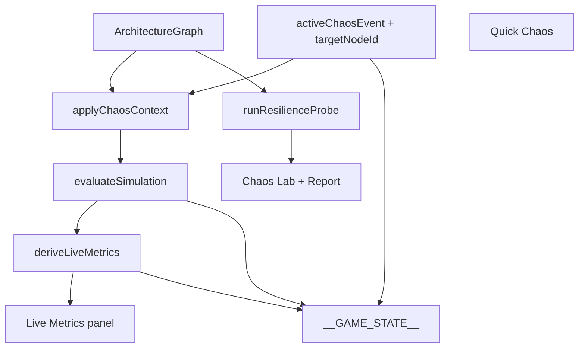

# Chaos Lab Design

**Spec**: `.specs/features/chaos-lab/spec.md`  
**Context**: `.specs/features/chaos-lab/context.md`  
**Status**: Approved (plan lock 1A/2A)

---

## Architecture Overview

Ephemeral chaos is a **client session overlay**. Shared pure functions transform evaluation inputs/outputs; UI mounts only when `mode !== 'speedrun'`.



**AD-037:** Chaos experiment state is ephemeral client session state (`activeChaosEvent`, `chaosTargetNodeId`, `resilienceReport`). It is not part of `ArchitectureGraph`, is omitted from session save/load and judge payloads, and is unavailable in Speedrun.

---

## Code Reuse Analysis

| Component | Location | How to Use |
| --------- | -------- | ---------- |
| evaluateSimulation | `libs/shared/src/simulation/evaluate-simulation.ts` | Optional chaos arg; extend return fields |
| analyzeTopology | `libs/shared/src/simulation/analyze-topology.ts` | Unchanged; still runs on chaos-eval if desired |
| Workload/Mentor drawers | `client/src/ui/workload-panel.ts`, `mentor-panel.ts` | FAB/backdrop/open/close/exclusivity pattern |
| Findings panel | `client/src/ui/findings-panel.ts` | Sync model for Live Metrics |
| Sim controls | `client/src/ui/sim-controls.ts` | Compact toolbar pattern for Quick Chaos |
| phase-navigation | `client/src/session/phase-navigation.ts` | Mount guard + refresh loop |
| i18n catalogs | `client/src/i18n/catalog-*.ts` | New keys |
| test-hook | `client/src/test-hook.ts` | Typed chaos/metrics fields |

---

## Components

### failure-catalog

- **Location**: `libs/shared/src/resilience/failure-catalog.ts`
- **Interfaces**:
  - `ChaosEventId` union
  - `ChaosEventDef { id, group: 'quick'|'infra'|'network', scope: 'global'|'targeted', labelEn, labelPt, descriptionEn, descriptionPt }`
  - `listChaosEvents(group?)`, `getChaosEvent(id)`, `QUICK_CHAOS_IDS`
- **Reuses**: component-catalog style typed metadata

### chaos-modifiers

- **Location**: `libs/shared/src/resilience/chaos-modifiers.ts`
- **Interfaces**:
  - `ChaosContext { eventId: ChaosEventId; targetNodeId?: string }`
  - `ChaosEffects { capacityMultiplierByNode, ingressMultiplier, hitRateOverride, latencyFloorMs, errorRate, availabilityCap, reasonEn, reasonPt }`
  - `resolveChaosEffects(graph, ctx): ChaosEffects`
- **Modifier map (pedagogical)**:

| Event | Effects |
| ----- | ------- |
| cpu_spike | target capacity ×0.5 |
| network_partition | target capacity ×0.15; availabilityCap 40; errorRate 0.35 |
| high_latency | latencyFloorMs 250; availabilityCap 99 |
| connection_flap | errorRate 0.25; availabilityCap 50 |
| instance_crash | target capacity ×0 if replicas≤1 else ×((r-1)/r); avail drop |
| cache_stampede | hitRateOverride 0 on caches; DB pressure rises via eval |
| traffic_surge | ingressMultiplier 5 |
| az_failure | all capacity ×0.5; availabilityCap 50 |
| dc_failure | capacity ×0.1; availabilityCap 10; errorRate 0.5 |
| instance_slow | target capacity ×0.4; latencyFloor 180 |
| disk_failure | target capacity ×0.5; errorRate 0.2; availabilityCap 85 |
| disk_corruption | errorRate 0.4; availabilityCap 70 |
| storage_iops | target capacity ×0.35; latencyFloor 200 |
| filesystem | latencyFloor 220; errorRate 0.15 |
| vm_cpu | target capacity ×0.5; latencyFloor 160 |
| host_hardware | same as instance_crash |
| cross_region_loss | latencyFloor 300; errorRate 0.2; availabilityCap 80 |
| packet_loss | errorRate 0.3; availabilityCap 75 |

### evaluateSimulation extension

- Signature: `evaluateSimulation(graph, chaos?: ChaosContext | null)`
- Apply effects: multiply per-node capacity; override cache hit rates on normalized clone; multiply ingress via temporary sim fields; after pressure loop, set `errorRate`, `availability` (100 − f(error, caps, hot)), `avgLatencyMs` / `p95LatencyMs` / `p99LatencyMs` from node latencies (+ floor)
- Baseline (no chaos) must keep existing fixture behavior for pressures; new fields default errorRate=0, availability≈100 when all ok

### derive-live-metrics

- **Location**: `libs/shared/src/resilience/derive-live-metrics.ts`
- `LiveMetrics { totalRps, avgLatencyMs, p95LatencyMs, p99LatencyMs, errorRate, availability, budgetBurn, hottestNodeId, hottestLabel, hottestPressurePct, slo: SloStatus[], tipEn, tipPt }`
- Budget burn: `errorBudgetUsed = max(0, (targetAvail - availability) / (100 - targetAvail))` when target < 100
- SLO from optional `SloTargets { availabilityTarget?, latencyP99TargetMs? }`

### run-resilience-probe

- **Location**: `libs/shared/src/resilience/run-resilience-probe.ts`
- `runResilienceProbe(graph, eventId, targetNodeId?, slo?): ResilienceResult`
- Always evaluates with that event alone (does not compose with UI-active chaos)
- Returns `{ eventId, minAvailability, p99Ms, verdict: 'SURVIVED'|'FAILED' }`

### Client UI

| Module | Notes |
| ------ | ----- |
| `live-metrics-panel.ts` | sync(LiveMetrics); FAB on phone |
| `quick-chaos-toolbar.ts` | chips; active state; disabled if empty graph |
| `chaos-lab-panel.ts` | drawer + catalog buttons + embeds report |
| `resilience-report.ts` | desktop table / phone cards; Clear |
| Wire `phase-navigation.ts` | skip speedrun; exclusivity; re-eval with chaos |

### GameState extensions

```typescript
activeChaosEvent: ChaosEventId | null;
chaosTargetNodeId: string | null;
liveMetrics: LiveMetrics | null;
resilienceReport: ResilienceResult[];
```

---

## Error Handling Strategy

| Scenario | Handling | User Impact |
| -------- | -------- | ----------- |
| Empty graph | Disable chaos; probe no-op | Hint in lab |
| Unknown event id | Ignore / no-op | Dev assert in tests |
| Target missing | Resolve hottest / clear | Stable pressures |
| Speedrun | Do not mount | No chrome |

---

## Risks & Concerns

| Concern | Location | Impact | Mitigation |
| ------- | -------- | ------ | ---------- |
| Breaking AD-020 fixtures | evaluate-simulation | Regressions | Chaos optional; no-chaos path identical |
| Panel clutter | session UI | Unusable phone | FAB collapsed default + exclusivity |
| Judge pollution | phase-navigation judge POST | Wrong scores | Omit chaos from payload |
| Fake metrics trust | derive-live-metrics | Pedagogy confusion | Tip labels educational; formulas in design |

---

## Tech Decisions

| Decision | Choice | Rationale |
| -------- | ------ | --------- |
| Chaos storage | Ephemeral GameState only | AD-037 / 2A |
| Eval hook | Optional 2nd arg | Minimal API break |
| Probe isolation | Always event-alone | 2A report semantics |
| Project AD | AD-037 | Future features must not persist chaos in graph |
