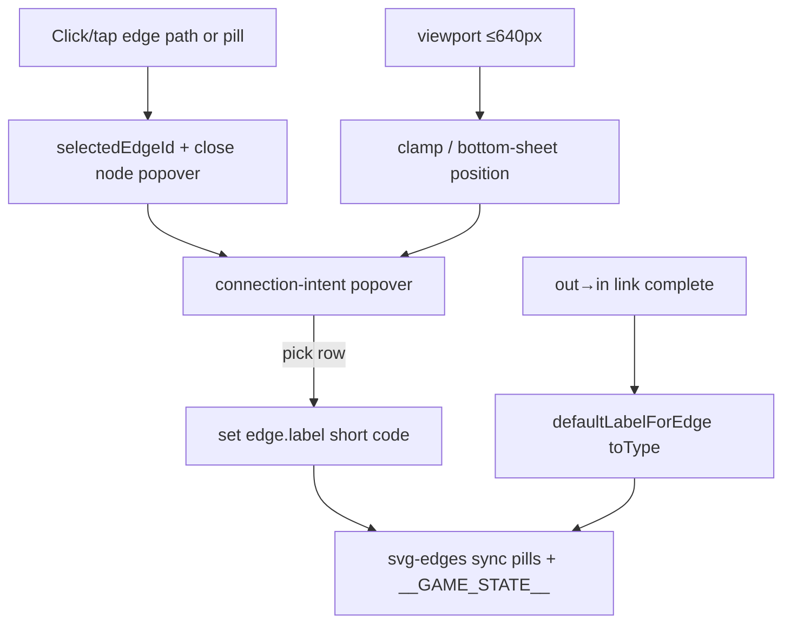

# Connection Intent — Design

**Spec:** `.specs/features/connection-intent/spec.md`  
**Context:** `.specs/features/connection-intent/context.md` (confirmed 2026-07-27)  
**Branch:** `feature/playground-parity`  
**Status:** Approved 2026-07-27 — Tasks drafted; Execute after tasks approve  

**Complexity:** Medium (design kept lean; no approach fork)

---

## Architecture Overview

Client-only UX on the existing blueprint canvas. Curated **intent catalog** maps menu rows → `ConnectionEdge.label` (`REQ` | `DB` | `CACHE`). DEFAULT and ORIGIN FALLBACK are two menu rows that both write `DB`. Heuristic default on connect uses destination `ComponentType`. No schema migration; no sim changes (AD-020).



**AD conformance:** AD-003 DOM · AD-004 `ArchitectureGraph` · AD-010 `__GAME_STATE__` · AD-011 technical EN on intent chrome · AD-018 SVG edges · AD-020 sim ignores label · AD-021 sessions persist graph as-is (label already in JSON).

**Deploy (release, not runtime):** Hobby preview on team Spiral Out via MCP after Execute — `vercel.json` for Vite client (`dist/client`); API Fastify deferred to serverless follow-up or same-origin proxy if already patterned — Design preference: **static client first** on Hobby; sessions/judge need server URL env (document in Tasks deploy step).

---

## Code Reuse Analysis

### Existing Components to Leverage

| Component | Location | How to Use |
| --------- | -------- | ---------- |
| Config popover pattern | `client/src/blueprint/config-popover.ts` | Mirror mount/open/close/destroy + injectStyles + `data-testid` |
| SVG edge layer | `client/src/blueprint/svg-edges.ts` | Replace `<text>` with pill group; add `onEdgeActivate` via path click; keep Bezier/packets |
| Blueprint canvas | `client/src/blueprint/blueprint-canvas.ts` | Wire edge select, intent popover, heuristic label on create, Delete on edge |
| `ConnectionEdge` | `libs/shared/.../architecture-graph.ts` | Keep `label?: string` — no new field |
| `connectForTest` | `blueprint-canvas.ts` | Tests for heuristic + intent |
| Viewport-safe modal pattern | confirm modal (playground-parity) | Clamp popover / bottom sheet on narrow viewports |

### Integration Points

| System | Integration |
| ------ | ----------- |
| `__GAME_STATE__` | Expose `selectedEdgeId`; graph.edges[].label after picks |
| Sessions persistence | Transparent — label already serialized |
| Judge prompt | Already includes edges; richer labels = better pedagogy without code change |

---

## Components

### `connection-intents.ts` (catalog + heuristic)

- **Purpose:** Single source of truth for menu rows and default label by destination type
- **Location:** `client/src/blueprint/connection-intents.ts` (+ `.test.ts`)
- **Interfaces:**
  - `CONNECTION_INTENTS: ConnectionIntentOption[]` — `{ id, shortLabel, role, description }` where `shortLabel` is `REQ`|`DB`|`CACHE`; `id` distinguishes `db-default` vs `db-origin-fallback`
  - `defaultLabelForDestination(type: ComponentType): 'REQ' | 'DB' | 'CACHE'`
  - `resolveMenuSelection(edgeLabel: string | undefined): string | 'custom' | null` — which row is active / CUSTOM header
- **Dependencies:** `@sdq/shared` `ComponentType`
- **Reuses:** None — pure data/functions

### `connection-intent-popover.ts`

- **Purpose:** CONNECTION INTENT UI (header + option list)
- **Location:** `client/src/blueprint/connection-intent-popover.ts`
- **Interfaces:**
  - `mountConnectionIntentPopover(host, { onSelect, onClose }): { open(edgeId, label, anchor?), close, destroy }`
  - Open renders catalog; highlights active row; mobile: `position:fixed` bottom or clamped to viewport
- **Dependencies:** catalog module
- **Reuses:** Visual language of `config-popover` (dark panel, monospace)

### `svg-edges.ts` (extend)

- **Purpose:** Pill labels + pointer activation
- **Changes:**
  - Render foreignObject or SVG rect+text pill at mid-curve (`data-testid="edge-label"`)
  - `pointer-events: stroke` on path; pill also receives events
  - Optional callback `onEdgePointerDown(edgeId, ev)` registered by canvas
  - Preserve Bezier + packet animation (PP-04 / L-002)
- **Reuses:** `curvePath` / `pointOnEdgeCurve`

### `blueprint-canvas.ts` (wire)

- **Purpose:** Selection lifecycle + create heuristic + delete edge
- **Changes:**
  - On edge activate: set `selectedEdgeId`, clear node selection, close config popover, open intent popover
  - On connect: `label: defaultLabelForDestination(to.type)` instead of hard-coded `REQ`
  - Delete/Backspace removes selected edge
  - Mutual exclusion with node popover

---

## Data Models

No schema change. Catalog shape (client-only):

```typescript
type EdgeShortLabel = 'REQ' | 'DB' | 'CACHE';

interface ConnectionIntentOption {
  id: 'req' | 'db-default' | 'db-origin-fallback' | 'cache';
  shortLabel: EdgeShortLabel;
  role: string; // REQUEST | DEFAULT | ORIGIN FALLBACK | CACHE
  description: string;
}
```

**UI state (not persisted):** which menu row is “active” when `label === 'DB'` — prefer last-chosen `id` in a weak `Map<edgeId, intentId>` session memory, else highlight both DB rows neutrally / first DB row as DEFAULT. Spec allows both writing `DB`; Design choice: **session Map** so header shows correct role after pick; reload → DEFAULT if `label==='DB'`.

---

## Error Handling Strategy

| Scenario | Handling | User impact |
| -------- | -------- | ----------- |
| Legacy custom label | Pill shows text; header `CUSTOM`; no row selected | Can pick catalog to overwrite |
| Tap misses edge | No-op / pan as today | Unchanged |
| Popover would overflow | Clamp / bottom sheet ≤640px | Always reachable options |
| Deploy without API | Client static; API calls fail soft as today | Document env for preview |

---

## Risks & Concerns

| Concern | Location | Impact | Mitigation |
| ------- | -------- | ------ | ---------- |
| `selectedEdgeId` never wired | `blueprint-canvas.ts` | Dead state | T-wire task adds path listeners |
| `svg.innerHTML = ''` wipes listeners each sync | `svg-edges.ts` | Need re-bind or event delegation on svg | Delegate `pointerdown` on layer svg once |
| Packet + pill mid-point collision | `svg-edges.ts` | Visual clutter when sim running | Pill offset slightly above mid; z-order path under pill |
| Mobile false pan vs edge tap | canvas pointer handlers | Hard to select edge | Prefer stroke hit; short tap vs pan threshold if needed |
| Spec-precision: vague mobile | CI-05 | Weak tests | Assert popover `getBoundingClientRect` within viewport in JSDOM mock |
| Monorepo Vercel | no `vercel.json` | Deploy fails / no API | Task: client static + `VITE_*` API URL; note Fastify follow-up |

---

## Tech Decisions (feature-local)

| Decision | Choice | Rationale |
| -------- | ------ | --------- |
| Persist only `label` | No `intent` field | Avoid migration; Discuss |
| DB dual rows → same label | Session Map for UI role | Spec serialização |
| Event binding | Delegation on SVG root | Survives `innerHTML` clear |
| Mobile layout | Bottom sheet ≤640px width | Context agent discretion |
| Deploy MVP | Static Vite client on Hobby | Fastest free preview; API later |

No new `AD-NNN` — conventions stay feature-local.

---

## Test plan (feeds Tasks matrix)

- Unit: `defaultLabelForDestination`, catalog shortLabels, resolve selection/CUSTOM  
- Blueprint: pill render, click/tap opens `[data-testid="connection-intent"]`, pick updates graph label, heuristic on connect, delete edge, viewport clamp mock 375×667  
- Gate: `npx nx run-many -t lint test` (full); quick: `npx nx test client`
