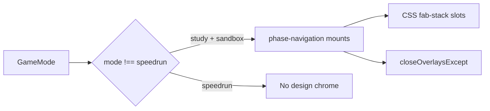

# Design Mode Chrome — Design

**Spec**: `.specs/features/design-mode-chrome/spec.md`  
**Status**: Approved (user follow-up lock)

---

## Architecture Overview

Thin wiring + shared FAB stack tokens. No new sim/chaos math.

**AD-038:** Right-edge FAB stack slots via CSS variables (`--sdq-fab-stack-*`). Slot order bottom→top: workload(0), mentor(1), chaos(2), metrics(3).

**AD-033 extended:** Mentor chrome mounts in `study` and `sandbox` (API still on-demand).

**AD-035 extended:** Workload FAB mounts in Practice; exclusivity includes Chaos + Metrics.

**AD-037 clarified:** Chaos chrome for design modes only; Speedrun still excluded.

---

## Components

| Change | Location | Notes |
| ------ | -------- | ----- |
| Mount guard | `phase-navigation.ts` | `designChrome = mode !== 'speedrun'`; mount workload+mentor+chaos when true |
| Stack tokens | `theme/global.css` | `--sdq-fab-stack-base/gap/size/inset` + utility comments |
| Workload FAB | `workload-panel.ts` | `right` + slot 0; guideline fixes |
| Mentor FAB | `mentor-panel.ts` | slot 1 |
| Chaos FAB | `chaos-lab-panel.ts` | slot 2 |
| Metrics FAB | `live-metrics-panel.ts` | slot 3 |
| Tests | `phase-navigation.test.ts`, panel UI tests | Mode guards + stack CSS |

---

## Tech Decisions

| Decision | Choice | Rationale |
| -------- | ------ | --------- |
| Speedrun | No design chrome | Ranking fairness |
| Stack CSS | Shared variables, not JS layout | Deterministic; mobile+desktop |
| Metrics | 4th slot above trio | Available without crowding left palette |
