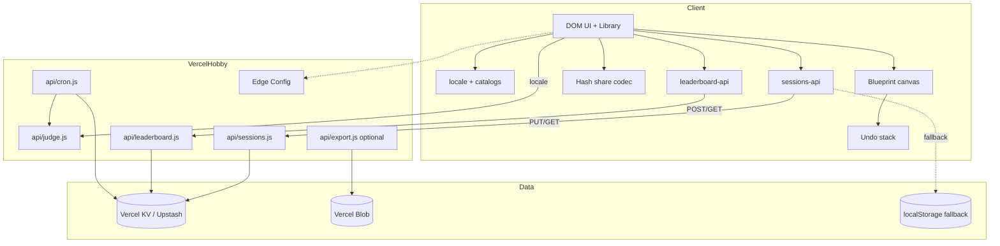

# Hobby Platform Design

**Spec**: `.specs/features/hobby-platform/spec.md`  
**Context**: `.specs/features/hobby-platform/context.md`  
**Status**: Approved  
**Approach**: Thin multi-route serverless + shared domain (AD-025)

---

## Architecture Overview

Extend the existing Hobby pattern (`api/judge.js` from `server/src/vercel/api-judge.ts`): add thin Vercel handlers for sessions, leaderboard, cron, and optional Blob upload. Domain services stay in `server/src` behind store interfaces; **KV adapters** implement `SessionStore` / `LeaderboardStore`. Fastify local wiring keeps in-memory/file stores for tests and `nx serve`.

Client gains a small **i18n** layer (locale preference + string catalogs + localized problem view). Canvas UX (undo, share hash, continue, progress %) stays client-side. Edge Config + Web Analytics are read/emit-only from the client (fail-open).



---

## Code Reuse Analysis

### Existing Components to Leverage

| Component | Location | How to Use |
| --------- | -------- | ---------- |
| Vercel judge handler | `server/src/vercel/api-judge.ts` | Clone pattern for sessions/leaderboard/cron handlers |
| Judge request core | `server/src/judge/handle-judge-request.ts` | Pass `locale` into prompts/mock |
| Session service | `server/src/sessions/service.ts` | Unchanged; inject KV `SessionStore` |
| Session store iface | `server/src/sessions/store.ts` | New `KvSessionStore` |
| Client sessions API | `client/src/sessions/sessions-api.ts` | Prefer remote when 200; keep local fallback |
| Local sessions | `client/src/sessions/local-sessions.ts` | Offline/Hobby-without-KV cache |
| Leaderboard service | `server/src/leaderboard/service.ts` | Unchanged; inject KV store |
| Leaderboard sort | `server/src/leaderboard/store.ts` | Preserve speedrun order: `elapsedMs` asc, then `score` desc |
| Progress store | `client/src/storage/progress.ts` | Drive % badges; persist as today |
| Problem catalog | `libs/shared/src/problems/*` | Add locale fields + resolver |
| Preferences | `client/src/storage/preferences.ts` | Sibling pattern for `sdq-locale` |
| Result → sessions CTA | `client/src/ui/result-panel.ts` | Wire auto-confirm before open |
| Session confirm modal | `client/src/ui/session-confirm-modal.ts` | Expose confirm+close API |
| `__GAME_STATE__` | canvas bootstrap | Assert undo/share graph |
| `vercel.json` build | root | Extend esbuild outs for new `api/*.js` |

### Integration Points

| System | Integration Method |
| ------ | ------------------ |
| Vercel KV | `@vercel/kv` via env `KV_REST_API_URL` / `KV_REST_API_TOKEN` (Upstash) |
| Vercel Blob | `@vercel/blob` when `BLOB_READ_WRITE_TOKEN` set |
| Edge Config | `@vercel/edge-config` or fetch Connection string; client reads flags at bootstrap |
| Web Analytics | `@vercel/analytics` + thin `track(event, props)` wrapper |
| Fastify | Existing `/api/sessions` + `/api/leaderboard` routes keep working with injectable stores |
| Judge | Body field `locale: 'en' \| 'pt-BR'` |

---

## Components

### Locale module

- **Purpose**: Persist and resolve active locale; provide `t(key)` for UI chrome.
- **Location**: `client/src/i18n/` (`locale.ts`, `catalog-en.ts`, `catalog-pt-BR.ts`, `t.ts`)
- **Interfaces**:
  - `getLocale(storage?): Locale`
  - `setLocale(locale, storage?): void`
  - `t(key: string, locale?: Locale): string`
  - `subscribeLocale(listener): unsubscribe` (optional remount helper)
- **Dependencies**: `localStorage` key `sdq-locale`
- **Reuses**: preferences/nickname storage helpers pattern

### Library language controls

- **Purpose**: EN / PT-BR buttons on problem library chrome.
- **Location**: `client/src/ui/problem-library.ts` (+ CSS)
- **Interfaces**: buttons `data-testid="locale-en"` / `locale-pt-BR"`; on click → `setLocale` + remount/refresh library strings
- **Dependencies**: locale module
- **Reuses**: existing library chrome (“Minhas sessões”)

### Localized problems

- **Purpose**: Resolve problem copy per locale without duplicating ids/rubrics structure.
- **Location**: `libs/shared/src/i18n/` + extend problem data; `localizeProblem(problem, locale): LocalizedProblem`
- **Interfaces**:
  - Fields localized: `title`, `description`, `constraints`, `suggestedRequirements`, (optional tag display labels)
  - Rubric stays language-agnostic English for judge scoring consistency; Judge **narrative** locale is separate
- **Dependencies**: `Problem` schema evolution (`LocalizedString` or parallel `copy: Record<Locale, ProblemCopy>`)
- **Reuses**: `getProblem` / `listProblems`

### Judge locale

- **Purpose**: Prompts + mock responses in request locale.
- **Location**: `server/src/judge/prompts.ts`, mock client fixtures, `handle-judge-request.ts`, client judge caller
- **Interfaces**: `JudgeInput.locale?: 'en' | 'pt-BR'` (default `pt-BR`)
- **Dependencies**: shared type update
- **Reuses**: dual-judge orchestration unchanged (AD-016)

### KvSessionStore

- **Purpose**: Durable sessions on Hobby.
- **Location**: `server/src/sessions/kv-store.ts`
- **Interfaces**: implements `SessionStore`
  - Keys: `sess:{id}` → JSON record; `sessidx:{nickname}` → set/list of ids
  - Cap 50/nickname enforced in service (existing)
- **Dependencies**: `@vercel/kv`
- **Reuses**: `createSessionService`

### KvLeaderboardStore

- **Purpose**: Durable speedrun rankings.
- **Location**: `server/src/leaderboard/kv-store.ts`
- **Interfaces**: implements `LeaderboardStore`
  - Key: `lb:{problemId}` → sorted list or hash+zset; upsert keeps **best** entry per nickname (lower `elapsedMs`, tie → higher score)
- **Dependencies**: `@vercel/kv`
- **Reuses**: `createLeaderboardService` + `isQualifyingForLeaderboard`

### Vercel handlers

- **Purpose**: Thin HTTP adapters.
- **Location**: `server/src/vercel/api-sessions.ts`, `api-leaderboard.ts`, `api-cron.ts`, optional `api-export.ts` → esbuild → `api/*.js`
- **Interfaces**: same contracts as Fastify routes (GET/PUT sessions; GET/POST leaderboard)
- **Dependencies**: services + KV env
- **Reuses**: `api-judge.ts` status/method handling style

### Auto-confirm sessions CTA

- **Purpose**: “Ver em Minhas sessões” confirms pending upsert, closes modal, opens dashboard.
- **Location**: `client/src/ui/result-panel.ts` + session flow orchestrator (bootstrap / phase-navigation)
- **Interfaces**: `onOpenSessions` becomes async confirm-then-open; modal `confirmAndClose()`
- **Dependencies**: sessions-api upsert
- **Reuses**: existing confirm modal primary action

### Canvas undo/redo

- **Purpose**: Snapshot stack for graph mutations.
- **Location**: `client/src/canvas/history.ts` (+ wire into graph mutations / `__GAME_STATE__`)
- **Interfaces**:
  - `push(graph)`, `undo(): ArchitectureGraph | null`, `redo(): ArchitectureGraph | null`
  - max depth 50; keyboard Ctrl/Cmd+Z, Ctrl+Y / Ctrl+Shift+Z; mobile Undo/Redo buttons
- **Dependencies**: deep clone via existing `normalizeGraph` / structuredClone
- **Reuses**: game state setter used by DnD/connect

### Share hash codec

- **Purpose**: Compact `{ problemId, graph }` in `location.hash`.
- **Location**: `client/src/share/codec.ts`, bootstrap hash parse
- **Interfaces**: `encodeShare(payload): string`, `decodeShare(hash): SharePayload | null`; soft fail > ~8KB
- **Dependencies**: CompressionStream when available; fallback JSON+base64url
- **Reuses**: `ArchitectureGraph` types

### Progress % + continue shortcut

- **Purpose**: Per-difficulty completion % badges; resume latest `in_progress`.
- **Location**: `problem-library.ts` + `progress.ts` helpers; sessions list for continue
- **Interfaces**: `completionPercentByDifficulty(progress, catalog)`, `data-testid="continue-session"`
- **Dependencies**: progress store + sessions-api list
- **Reuses**: `isQualifyingCompletion` / existing completion recording

### Blob export

- **Purpose**: Client download JSON/SVG/PNG; optional upload via `/api/export` or client `put` with tokened URL.
- **Location**: `client/src/export/` + optional vercel handler
- **Interfaces**: `exportSessionJson`, `exportDiagramSvg`, `exportDiagramPng`
- **Dependencies**: DOM Serializer / canvas snapshot; Blob token optional
- **Reuses**: graph serialization

### Edge Config client

- **Purpose**: Maintenance + new-problem flags without redeploy.
- **Location**: `client/src/config/edge-flags.ts`
- **Interfaces**: `loadEdgeFlags(): Promise<EdgeFlags>`; fail-open defaults
- **Dependencies**: `EDGE_CONFIG` / public connection string
- **Reuses**: library banner slot

### Cron job

- **Purpose**: Daily cleanup + aggregate + judge warm-up.
- **Location**: `server/src/vercel/api-cron.ts` + `vercel.json` crons
- **Interfaces**: authorize `Authorization: Bearer CRON_SECRET` or Vercel cron header; delete sessions `updatedAt` < now−90d; increment `stats:daily:{yyyy-mm-dd}`; POST local judge warm
- **Dependencies**: KV + judge URL
- **Reuses**: KvSessionStore scan/delete helpers

### Analytics wrapper

- **Purpose**: Phase + abandon events.
- **Location**: `client/src/analytics/track.ts`
- **Interfaces**: `track(name, props?)` no-op when unavailable
- **Dependencies**: `@vercel/analytics`
- **Reuses**: phase-navigation hooks

---

## Data Models

### Locale

```typescript
type Locale = 'en' | 'pt-BR';
```

### Localized problem copy

```typescript
interface ProblemCopy {
  title: string;
  description: string;
  constraints: string[];
  suggestedRequirements: SuggestedRequirements;
}

// Problem gains:
// copy: { en: ProblemCopy; 'pt-BR': ProblemCopy }
// OR dual fields resolved by localizeProblem()
```

### KV session keys

```typescript
// sess:{sessionId} -> DesignSessionRecord JSON
// sessidx:{nickname} -> string[] session ids
```

### Share payload

```typescript
interface SharePayload {
  v: 1;
  problemId: string;
  graph: ArchitectureGraph;
}
```

### Edge flags

```typescript
interface EdgeFlags {
  maintenance: boolean;
  maintenanceMessage?: string;
  newProblemIds?: string[];
  bannerText?: string;
}
```

**Leaderboard ordering note:** Spec draft said score-desc; **implementation keeps existing speedrun order** (`elapsedMs` asc, then `score` desc) to honor AD-016 speedrun ranking already in `InMemoryLeaderboardStore`. Spec AC for LB-01 is interpreted as “ordered for speedrun,” not score-primary.

**Neon:** Not in architecture. Progress % derived from `sdq-progress` (+ optional session statuses). Revisit only if a documented query gap appears (NEON-01).

---

## Error Handling Strategy

| Error Scenario | Handling | User Impact |
| -------------- | -------- | ----------- |
| KV down on upsert/list | Client falls back to localStorage; optional toast | Sessions still work on-device |
| KV down on leaderboard | Soft fail write; empty/error list UI | Play continues |
| Blob missing | Client-only download | Export still works |
| Edge Config fail | Flags default off | App playable |
| Share oversize | Block hash; offer JSON export | Clear message |
| Malformed share hash | Ignore + toast | Normal library |
| Cron unauthorized | 401 | No cleanup |
| Judge without locale | Default `pt-BR` | Consistent with AD default |
| Auto-confirm upsert fail | Error toast; modal closed or recoverable | No stuck overlay |

---

## Risks & Concerns

| Concern | Location | Impact | Mitigation |
| ------- | -------- | ------ | ---------- |
| Dual content for 27 problems is large | `libs/shared/src/problems/*` | Missed translations / drift | Shared `ProblemCopy` + tests that every problem has both locales; allow EN fallback to PT temporarily only in tests fail-closed for launch |
| KV command budget ~10k/day | Hobby free tier | Throttle / outage | Index keys minimize LIST scans; cron batched; client caches list |
| Session LWW multi-device | sessions service | Silent overwrite | Document; `updatedAt` compare on merge client↔KV |
| esbuild multi-entry build complexity | `vercel.json` | Broken deploy | Parallel esbuild outs mirrored from judge; CI build smoke |
| Undo memory on large graphs | canvas history | Jank on mobile | Cap 50; store normalized clones only |
| Hash URL length | share codec | Broken shares | Soft 8KB + Blob/JSON fallback |
| Leaderboard “best” semantics vs append-only memory store | kv-store | Duplicate nicknames | KV store dedupes by nickname; memory store behavior unchanged in unit tests |
| Fragile confirm→sessions flow | `result-panel.ts` | Modal stack bug regresses | Dedicated test: confirm pending + CTA → modal absent |

---

## Tech Decisions

| Decision | Choice | Rationale |
| -------- | ------ | --------- |
| Deploy shape | Multi `api/*.js` esbuild entries | Matches AD-022/judge; isolates timeouts |
| Session durability | KV primary, localStorage fallback | Spec priority + offline |
| Problem i18n shape | Per-locale `ProblemCopy` on each problem | Explicit, testable, no runtime AI translate |
| Judge rubric language | Keep English rubric; localize narrative output | Scoring stability |
| Leaderboard sort | Keep elapsedMs-primary | Existing speedrun semantics |
| Share | Hash compact v1 | No Blob dependency for review links |
| Neon | Deferred | KV sufficient for listed queries |
| Project decisions | AD-024 locale; AD-025 Hobby KV | STATE.md |

---

## AD updates (applied in STATE.md)

- **AD-024** supersedes **AD-011**: bilingual EN/PT-BR with persisted preference; jargon stays English.
- **AD-025** supersedes durable-store portion of **AD-022**: Hobby sessions + leaderboard via thin serverless + KV; localStorage remains fallback; judge hybrid unchanged.

---

## Confirm before Tasks

Approved 2026-07-28 — proceeded to `tasks.md`.
