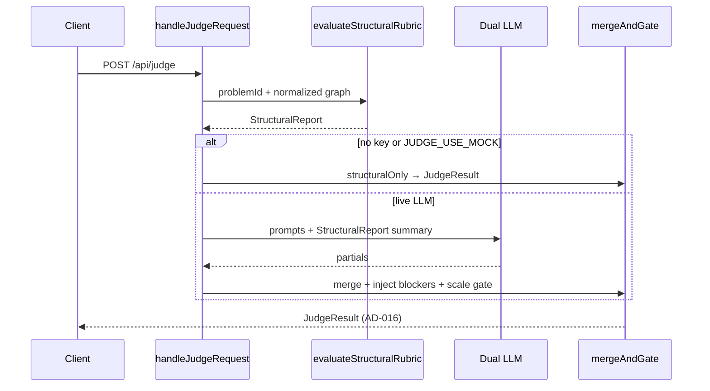
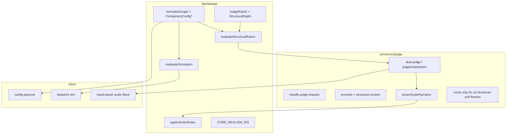

# Judge Realism — Design

**Spec:** `.specs/features/judge-realism/spec.md`  
**Context:** `.specs/features/judge-realism/context.md`  
**Status:** Approved — 2026-07-28 (Approach A)

---

## Approach exploration (Complex)

Same scoped outcome (Baseline 27 + Deep Core 13 + hybrid LLM + configs↔sim/judge + discrimination). Three ways to build it:

| | **A — Structural-first shared engine** (recommended) | **B — Prompt-heavy + thin must-have** | **C — Per-problem judge plugins** |
| - | --------------------------------------------------- | ------------------------------------- | --------------------------------- |
| Idea | Pure `evaluateStructuralRubric()` in `libs/shared`; LLM only after / constrained by it | Check `expectedComponents` only; put rigor in prompts | One TypeScript module per Core problem with custom logic |
| Trust / CI | Strong — discrimination without network | Weak when key missing; CI still thin | Strong but expensive |
| Fit to codebase | Extends existing `JudgeRubric`, `dual-judge`, `normalizeGraph`, sim | Smallest diff; fails JR-02/06 spirit | Fights shared catalog pattern |
| Cost | Medium | Low short-term / high regret | High |

**Recommendation: A.** Matches 1C/5A/6A/4C, keeps Vitest in shared, kills golden reuse at the source.

Confirm **A** (or B/C) before Tasks. Design below details **A**.

---

## Architecture Overview

Judge pipeline becomes **structural → (optional) dual-LLM → hard merge → scale post-check → AD-016**.

- **Baseline (27):** must-have coverage from `expectedComponents` (+ optional light `forbiddenTypes`) + one scale checklist line from problem metrics/tags.
- **Deep (Core 13):** anti-patterns, config adequacy rules, richer scale checklist (≥2 dims on Core Hard).
- **No key / `JUDGE_USE_MOCK`:** return structural-built `JudgeResult` — **never** URL-shortener golden fixtures for other problems.
- **With key:** LLM narrative + soft score; structural blockers and missing scale narrative hard-constrain verdict.





---

## Code Reuse Analysis

### Existing Components to Leverage

| Component | Location | How to Use |
| --------- | -------- | ---------- |
| `JudgeRubric` / problems | `libs/shared/src/schema/problem.ts`, `problems/*` | Extend rubric; keep `expectedComponents` as Baseline must-haves |
| `judgeSubmission` / merge | `server/src/judge/dual-judge.ts` | Insert structural + scale gates around merge |
| `applyVerdictRules` | `libs/shared` | Unchanged AD-016 after gates |
| `normalizeGraph` / configs | `libs/shared/src/schema/normalize-graph.ts` | Add new config kinds + clamps |
| `evaluateSimulation` | `libs/shared/src/simulation/evaluate-simulation.ts` | Consume new knobs (TTL, MQ, WS, LB) |
| `config-popover` | `client/src/blueprint/config-popover.ts` | Render new fields by `config.kind` |
| Golden graphs / URL fixtures | `libs/shared` + `server/.../url-shortener-responses.ts` | **Scope to `url-shortener` tests only** — not production mock for all problems |
| `handleJudgeRequest` | `server/src/judge/handle-judge-request.ts` | Branch structural-only vs LLM |
| Catalog tests | `libs/shared/src/problems/catalog.test.ts` | Assert Baseline/Deep field presence |
| Result panel | `client/src/ui/result-panel.ts` | Show `scaleNarrative` |

### Integration Points

| System | Integration |
| ------ | ----------- |
| `POST /api/judge` (Fastify + Vercel `api/judge.js`) | Same HTTP contract; richer `JudgeResult` (+ `scaleNarrative`); rebuild serverless bundle |
| Problem library | Data-only rubric enrichment; no UI library changes required |
| Leaderboard / sessions | Unchanged; still consume AD-016 verdict |
| Locale AD-024 | Structural messages + scale checklist localized `en` \| `pt-BR` |

---

## Components

### 1. Structural rubric schema + Core set

- **Purpose:** Declare Baseline vs Deep expectations per problem.
- **Location:** `libs/shared/src/schema/problem.ts`, `libs/shared/src/problems/structural-depth.ts` (export `CORE_REALISM_IDS`), per-problem rubric fields in `easy.ts` / `medium.ts` / `hard.ts` / `url-shortener.ts`.
- **Interfaces:**
  - `isCoreRealismProblem(id: string): boolean`
  - Extended `JudgeRubric` (see Data Models)
- **Dependencies:** existing `Problem` / `ComponentType`
- **Reuses:** current `expectedComponents`, `criticalPatterns`, `commonMistakes` (map into Deep where present)

### 2. `evaluateStructuralRubric`

- **Purpose:** Deterministic problem-specific evaluation → blockers, majors, scale checklist, config findings, score hint.
- **Location:** `libs/shared/src/judge/evaluate-structural-rubric.ts` (+ tests)
- **Interfaces:**
  - `evaluateStructuralRubric(input: { problem: Problem; graph: ArchitectureGraph; locale: Locale }): StructuralReport`
- **Rules (Baseline):**
  - Missing must-have type → `blocker` code `missing_component`
  - Present must-haves → strengths / no blocker
  - Always emit `scaleChecklistLines` (≥1; Core Hard ≥2)
- **Rules (Deep extra):**
  - `antiPatterns[]` (e.g. zoom without `media_server`/`signaling_server`; stripe without queue/idempotency cue via notes or mq)
  - `configRules[]` (min hitRate, min shards, etc.) → blocker or major
- **Dependencies:** `normalizeGraph` first (caller or internal)
- **Reuses:** problem metrics for checklist text (RPS, storage, DAU)

### 3. Judge pipeline orchestration

- **Purpose:** Wire structural + LLM + gates.
- **Location:** `server/src/judge/dual-judge.ts`, `handle-judge-request.ts`
- **Interfaces:**
  - `judgeSubmission` updated flow (structural always)
  - `buildStructuralOnlyResult(report, locale): JudgeResult`
  - `mergeWithStructuralHardGate(llmConsensus, report): JudgeResult`
  - `assertScaleNarrative(result): JudgeResult` — if LLM path and `scaleNarrative` empty → force score/verdict so not PASS
- **Dependencies:** `LlmClient` only on live path
- **Reuses:** `mergeConsensus`, `buildRequirementCoverage` (stop using `resolveGraphTier` for non-shortener coverage defaults — prefer structural/LLM only; for structural-only, coverage from declared reqs vs component heuristics or mark partial with structural explanation)

### 4. Mock / golden isolation

- **Purpose:** Kill cross-problem golden reuse (JR-02).
- **Location:** `server/src/judge/mock-llm-client.ts`
- **Behavior:**
  - Production mock path: **do not** call `getUrlShortenerPartialResult` for arbitrary graphs.
  - Prefer structural-only in `handleJudgeRequest` when `shouldUseMock` — mock LLM unused in that branch.
  - Keep golden helpers **exported for unit tests** that explicitly test `url-shortener` fixtures.
- **Reuses:** existing fixtures under test-only imports

### 5. Prompts

- **Purpose:** Problem-specific + structural context + scale mandate.
- **Location:** `server/src/judge/prompts.ts`
- **Interfaces:** include serialized `StructuralReport` summary, problem metrics, instruct dual judges to fill scale narrative; Core Hard: consistency/durability/coordination (JR-29)
- **Reuses:** existing rigorous/pragmatic builders

### 6. Scale-critical configs

- **Purpose:** Expand paper-icon knobs; affect sim + structural `configRules`.
- **Location:** `architecture-graph.ts`, `normalize-graph.ts`, `evaluate-simulation.ts`, `config-popover.ts`
- **Scale-critical kinds (7B):**
  | Type(s) | Config kind | Fields |
  | ------- | ----------- | ------ |
  | `cache_redis` | `cache` | `hitRate` (existing) |
  | `cdn` | `cdn` | `hitRate`, **`ttlSeconds`** (new) |
  | `sql_db` | `sql_db` | shards / strategy / skew (existing) |
  | `message_queue`, `kafka`, `pub_sub` | `mq` | `durability: 'memory'\|'disk'`, `partitionCount` |
  | `websocket_gateway` | `ws` | `fanOutLimit` |
  | `load_balancer` | `lb` | `algorithm: 'round_robin'\|'least_conn'\|'ip_hash'` |
- **Sim:** TTL low → weaker CDN relief; MQ memory → higher warn under traffic; WS fan-out low → hot on gateway; LB algorithm minor capacity tweak
- **Judge:** Deep Core rules reference thresholds; Baseline may ignore configs except obvious cache hitRate on Easy Core

### 7. Result UI

- **Purpose:** Surface scale narrative / checklist.
- **Location:** `client/src/ui/result-panel.ts` (+ i18n strings)
- **Behavior:** dedicated section for `scaleNarrative`; structural-only shows checklist joined into that field

### 8. Discrimination suite

- **Purpose:** JR-06–09 hard gate.
- **Location:** `libs/shared` or `server/src/judge/discrimination.test.ts`
- **Minimum pairs (agent discretion locked here):**
  1. good `url-shortener` graph → `zoom-conference` ⇒ not PASS/PARTIAL
  2. good `url-shortener` → `youtube` ⇒ not PASS/PARTIAL
  3. chat-shaped (WS + mq) graph → `stripe-payments` ⇒ not PASS/PARTIAL
  4. (optional) `distributed-cache` good → `ticketmaster` ⇒ not PASS/PARTIAL
- **Path:** call `evaluateStructuralRubric` + `buildStructuralOnlyResult` (no LLM)

---

## Data Models

### Extended `JudgeRubric`

```typescript
export type StructuralDepth = 'baseline' | 'deep';

export interface StructuralAntiPattern {
  code: string; // e.g. 'missing_sfu_path'
  /** If any of these types present, pattern does not fire */
  unlessAnyOf?: string[];
  /** Fire when none of requiredAnyOf are present (and graph non-empty) */
  requiredAnyOf?: string[];
  /** Fire when forbidden type present */
  forbiddenType?: string;
  severity: 'blocker' | 'major';
  messageKey: string; // i18n key or en/pt map in localize layer
}

export interface StructuralConfigRule {
  code: string;
  componentType: string;
  /** JSON-path-like simple predicates evaluated in engine */
  minHitRate?: number;
  minShardCount?: number;
  minTtlSeconds?: number;
  minPartitionCount?: number;
  minFanOutLimit?: number;
  requireMqDurability?: 'disk';
  severity: 'blocker' | 'major';
  messageKey: string;
}

export interface JudgeRubric {
  expectedComponents: string[];
  criticalPatterns: string[];
  commonMistakes: string[];
  /** default baseline; core set forced to deep at runtime even if omitted */
  structuralDepth?: StructuralDepth;
  antiPatterns?: StructuralAntiPattern[];
  configRules?: StructuralConfigRule[];
  /** Explicit scale lines; if empty, engine derives from metrics */
  scaleChecklist?: { en: string[]; 'pt-BR': string[] };
}
```

### `StructuralReport`

```typescript
export interface StructuralReport {
  problemId: string;
  depth: StructuralDepth;
  scoreHint: number; // 0–100 prior to LLM
  blockers: FeedbackItem[];
  majors: FeedbackItem[];
  strengths: FeedbackItem[];
  scaleChecklistLines: string[];
  codes: string[]; // machine-readable for tests
}
```

### `JudgeResult` addition

```typescript
export interface JudgeResult {
  // ...existing fields
  /** Required for PASS on LLM path; structural-only fills from checklist */
  scaleNarrative: string;
  structuralCodes?: string[]; // optional debug/test hook
}
```

### `ComponentConfig` union extension

```typescript
export type ComponentConfig =
  | CacheConfig
  | CdnConfig // + ttlSeconds
  | SqlDbConfig
  | MqConfig
  | WsConfig
  | LbConfig;
```

### Core set constant

```typescript
export const CORE_REALISM_IDS = [
  'url-shortener', 'rate-limiter', 'pastebin', 'unique-id-gen',
  'distributed-cache', 'notification-system', 'key-value-store',
  'chat-system', 'news-feed', 'youtube',
  'zoom-conference', 'ticketmaster', 'stripe-payments',
] as const;
```

---

## Error Handling Strategy

| Scenario | Handling | User impact |
| -------- | -------- | ----------- |
| No `LLM_API_KEY` / mock | Structural-only result + note in `summary`/`nextStep` | Trustworthy FAIL/PARTIAL/PASS from rules; less prose |
| LLM timeout / parse error | Keep structural report; return structural-enriched result with “LLM unavailable” note (prefer 200 pedagogical over 502 when structural succeeded) — **or** preserve 502 if no structural blockers and LLM required for narrative; **Decision:** return **200 structural-only** with note when structural ran (better UX; JR failure assumption) |
| Unknown `problemId` | Existing 400 | Unchanged |
| Malformed graph | `normalizeGraph` then evaluate | Clamped configs |
| Missing scale on LLM PASS attempt | Downgrade: cannot PASS | See PARTIAL/FAIL + issue “Add scale analysis” |
| Rate limit | Existing 429 | Unchanged |

---

## Risks & Concerns

| Concern | Location | Impact | Mitigation |
| ------- | -------- | ------ | ---------- |
| Mock maps all graphs to URL-shortener fixtures | `mock-llm-client.ts:80-88` | False PASS on wrong problems | Structural-only branch; isolate fixtures to tests |
| `buildRequirementCoverage` uses `resolveGraphTier` | `dual-judge.ts:92` | Coverage tied to shortener tiers | Replace defaults with structural/LLM-only heuristics |
| `createJudgeLlmClient` 503 path confusing vs mock | `handle-judge-request.ts:76-84` | Dead/confusing branch | Structural-only does not need LLM client |
| Shallow configs | `architecture-graph.ts` / `config-popover.ts` | Weak sim/judge signal | Extend union + popover + sim modifiers |
| Vercel bundle drift | `api/judge.js` | Prod misses new logic | Existing esbuild step must rebuild on Execute |
| Rubric authoring burden for 27 Deep | problems/* | Shallow quality | Baseline auto from `expectedComponents`; Deep only Core 13 |
| Anti-pattern false positives | structural engine | Frustrated learners | Prefer `requiredAnyOf` groups; majors before blockers when ambiguous |
| Chat-exposed API key | ops | Abuse | Documented user accept; no key in repo |

---

## Tech Decisions

| Decision | Choice | Rationale |
| -------- | ------ | --------- |
| Architecture approach | **A — Structural-first shared engine** | CI trust + kills golden reuse |
| Structural home | `libs/shared` | Vitest without server; client could preview later |
| No-key behavior | Structural-only `JudgeResult` (no fake LLM debate) | Spec 5A |
| Scale field | First-class `scaleNarrative` on `JudgeResult` | Enforceable post-check |
| Config expansion | Additive union kinds `mq`/`ws`/`lb` + CDN TTL | Spec 2A/7B; AD-019 extended via AD-028 |
| Discrimination | Structural-only tests, ≥3 pairs listed above | Spec 4C |
| LLM failure | Degrade to structural 200 + note | Learning continuity |
| Deep content source | Enrich Core problem rubrics in TS data | No new CMS |

### Project-level decisions to append on Design approval

| ID | Decision |
| -- | -------- |
| **AD-027** | Judge pipeline is **structural-first**: problem rubrics evaluated deterministically before LLM; LLM cannot clear structural blockers; no cross-problem URL-shortener golden mock |
| **AD-028** | `ComponentConfig` scale-critical set includes cache/CDN(+TTL)/SQL/MQ/WS/LB; configs affect simulation and structural judge rules (extends AD-019) |

---

## DDIA / interview grounding (Design notes)

Used to shape **Deep** Core Hard rules (not separate product scope):

- **zoom-conference:** SFU path (`media_server` / signaling / TURN), fan-out limits on WS — availability vs fan-out.
- **ticketmaster:** queue + inventory lock cues; flash-sale backpressure — durability of holds.
- **stripe-payments:** idempotency/ledger cues (queue + sql + notes); exactly-once / at-least-once messaging.
- **Interview bar:** scale narrative must cite problem metrics (QPS/storage/fan-out) like a strong system-design interview answer.

---

## Phased delivery (maps to Tasks later)

1. Schema + engine Baseline + kill golden reuse + discrimination pair #1  
2. Structural-only HTTP path + `scaleNarrative`  
3. Live LLM hard-merge + scale PASS gate + prompts  
4. Config kinds + normalize + sim + popover  
5. Core Easy Deep rubrics  
6. Core Medium/Hard Deep rubrics + remaining discrimination pairs  
7. Result UI + rebuild `api/judge.js`

---

## Confirm before Tasks

Reply **approve design** / **approach A** (or pick B/C with changes). On approval: append AD-027/AD-028 to `STATE.md`, then Tasks.
