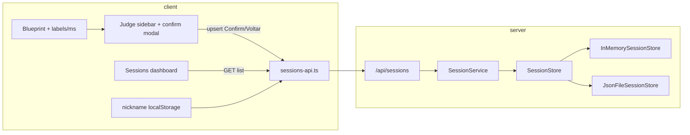

# Playground Parity — Design

**Spec:** `.specs/features/playground-parity/spec.md`  
**Context:** `.specs/features/playground-parity/context.md`  
**Branch:** `feature/playground-parity`  
**Status:** Approved  
**Approach:** **A — JSON file SessionStore** (user confirmed “go with recommendation”; design approved 2026-07-27)

---

## Architecture Overview

Two tracks delivered in one feature:

1. **Canvas / judge UX parity** (client-only): pressure labels, ms bar, 5× caps, remove Dicas, curve edges assert, judge right sidebar + viewport-safe confirm modal  
2. **Design sessions API** (shared types + Fastify + durable JSON file): upsert on Confirmar/Voltar, list dashboard by nickname + status, cap 50



**Durability note:** Context chose “API + DB”; Approach A implements **server-backed durable store** via JSON file (same spirit as speedrun design’s optional JSON file). Not SQL. Tests inject `InMemorySessionStore`. Prod path: env `SESSIONS_DATA_PATH` (default under server data dir).

**AD conformance:** AD-003 DOM UI · AD-004 serializable graph · AD-010 `__GAME_STATE__` · AD-011 PT-BR · AD-016 verdict mapping to session status · AD-018 SVG curves · AD-020 sim educational (speed visual-only; clamp 1–5). New **AD-021**: design-session history via Fastify + injectable SessionStore (JSON file prod / in-memory tests).

---

## Code Reuse Analysis

### Existing Components to Leverage

| Component | Location | How to Use |
| --------- | -------- | ---------- |
| Leaderboard store pattern | `server/src/leaderboard/store.ts` | Mirror `Store` interface + inject into routes/service |
| Nickname | `client/src/storage/nickname.ts` + `@sdq/shared` validators | Auth surrogate on upsert/list |
| `normalizeGraph` / sim clamp | `libs/shared/src/schema/normalize-graph.ts` | Change clamp 1–10 → **1–5** |
| `evaluateSimulation` | `libs/shared/src/simulation/` | Extend with educational `latencyMs` per node |
| `node-card` pressure classes | `client/src/blueprint/node-card.ts` | Add BOTTLENECK/QUEUEING + ms bar DOM |
| `svg-edges.curvePath` | `client/src/blueprint/svg-edges.ts` | Keep Bezier `C`; lock with tests (PP-04) |
| `sim-controls` | `client/src/ui/sim-controls.ts` | Slider max 5 |
| `result-panel` | `client/src/ui/result-panel.ts` | Restyle as right sidebar; add confirm/voltar actions |
| `phase-navigation` | `client/src/session/phase-navigation.ts` | Unmount hints; wire save + sidebar host |
| `leaderboard-api` pattern | `client/src/leaderboard/leaderboard-api.ts` | Clone for `sessions-api.ts` |
| `buildApp` DI | `server/src/main.ts` | Inject `sessionStore` like `leaderboardStore` |

### Integration Points

| System | Integration |
| ------ | ----------- |
| Fastify | `registerSessionRoutes(app, { store?, dataPath? })` |
| Session store (client) | Active play stays in-memory; persist only on Confirmar/Voltar |
| Problem library / bootstrap | Entry link/nav to sessions dashboard |
| Progress (`sdq-progress`) | Unchanged — separate concern |

---

## Components

### Shared — `libs/shared/src/schema/design-session.ts`

- **Purpose:** Types + helpers for persisted design sessions  
- **Interfaces:**
  - `DesignSessionStatus = 'approved' | 'rejected' | 'partial' | 'in_progress'`
  - `DesignSessionRecord` — see Data Models
  - `DesignSessionUpsertInput` — body for POST
  - `verdictToSessionStatus(verdict: Verdict): Exclude<DesignSessionStatus, 'in_progress'>`
  - `SESSION_CAP_PER_NICKNAME = 50`
- **Dependencies:** `ArchitectureGraph`, `JudgeResult` / `Verdict`, nickname helpers  
- **Reuses:** `normalizeNickname`, `isValidNickname`

### Shared — sim latency + clamp

- **Purpose:** PP-01 ms + PP-02 caps  
- **Location:** `evaluate-simulation.ts`, `normalize-graph.ts`  
- **Interfaces:**
  - `SimulationEvaluation` gains `latencyMs: Record<string, number>`
  - Mapping (fixed, testable): `ok→35`, `warn→120`, `hot→280` (educational ms; not real RTT)
  - `normalizeSimulation`: clamp speed/traffic to `[1, 5]`
- **Reuses:** existing pressure engine

### Server — `server/src/sessions/`

#### `store.ts`

- **Purpose:** Persistence abstraction  
- **Interfaces:**
  - `upsert(record: DesignSessionRecord): DesignSessionRecord`
  - `getById(id: string): DesignSessionRecord | null`
  - `listByNickname(nickname: string, status?: DesignSessionStatus): DesignSessionRecord[]`
  - `delete(id: string): void` (for eviction / tests)
  - `reset(): void` (tests)
- **Implementations:**
  - `InMemorySessionStore` — Map by id
  - `JsonFileSessionStore` — atomic write (`write tmp + rename`); load on construct; path from options

#### `service.ts`

- **Purpose:** Validate nickname, map status, upsert, enforce cap 50  
- **Interfaces:**
  - `upsert(input: DesignSessionUpsertInput, now?: () => string): UpsertOutcome`
  - `list(nickname: string, status?: DesignSessionStatus): DesignSessionRecord[]`
  - `get(id: string): DesignSessionRecord | null`
- **Rules:**
  - Invalid nickname → `INVALID_NICKNAME`
  - Invalid status / missing graph → `INVALID_BODY`
  - On upsert: normalize graph; set `updatedAt`; if new id would make count > 50 for nickname, delete oldest by `updatedAt` until ≤50 (**after** write, or before if new — prefer: write then while count>50 delete oldest ≠ current id)
  - `status` from client trusted for `in_progress`; for confirm paths client sends status derived via `verdictToSessionStatus` (server re-derives if `judgeResult.verdict` present)

#### `routes/sessions.ts`

- **Purpose:** HTTP surface  
- **Routes:**
  - `PUT /api/sessions/:id` — upsert full record (id in path must match body.id)
  - `GET /api/sessions?nickname=&status=` — list (nickname **required**)
  - `GET /api/sessions/:id` — single (for reopen)
- **Dependencies:** service + store injection via `buildApp({ sessionStore })`

### Client — simulation UI (PP-01, PP-02, PP-03, PP-04)

| Piece | Location | Change |
| ----- | -------- | ------ |
| Labels + ms bar | `node-card.ts` | When running: `hot`→BOTTLENECK red; `warn`→QUEUEING yellow; bar width/color from latency/pressure |
| `__GAME_STATE__` | `blueprint-canvas.ts` / test-hook | Expose `pressures` + `latencyMs` |
| Sim sliders | `sim-controls.ts` | max=5 |
| Hints | `phase-navigation.ts` | Stop mounting / destroy hints panel; tests expect absence |
| Curves | `svg-edges.ts` | No straight-line fallback; unit test path has `C`/`Q` |

### Client — judge sidebar + modal (PP-05, PP-06)

| Piece | Location | Change |
| ----- | -------- | ------ |
| Sidebar shell | `result-panel.ts` or new `judge-sidebar.ts` | Dock right; `data-testid="judge-sidebar"`; scroll body |
| Confirm modal | new `session-confirm-modal.ts` | Approved/Rejected/Partial copy from status; Confirmar / Voltar; `max-height: min(90dvh, …)`; overflow auto; primary actions sticky/visible at 375×667 |
| Wire save | `phase-navigation.ts` | Confirmar → `PUT` with status from verdict; Voltar (from result) → `PUT` `in_progress`; phase-back from canvas MAY also upsert `in_progress` (same helper) |
| Nickname | existing | `getOrCreateNickname()` on save/list |

### Client — dashboard (PP-07, PP-08)

| Piece | Location | Change |
| ----- | -------- | ------ |
| `sessions-api.ts` | `client/src/sessions/` | `upsertSession`, `listSessions`, `getSession` |
| `sessions-dashboard.ts` | `client/src/ui/` | Tabs/filters: Approved / Rejected / Partial / In Progress; empty states PT-BR; open → hydrate session + navigate canvas |
| Nav entry | bootstrap / library chrome | Link “Minhas sessões” / equivalent |

---

## Data Models

```typescript
type DesignSessionStatus = 'approved' | 'rejected' | 'partial' | 'in_progress';

interface DesignSessionRecord {
  id: string; // same as client session id when possible
  problemId: string;
  playerNickname: string;
  status: DesignSessionStatus;
  graph: ArchitectureGraph;
  requirements?: { functional: string[]; nonFunctional: string[] }; // optional P1; include if cheap
  judgeResult?: JudgeResult | null;
  score?: number;
  verdict?: Verdict | null;
  mode?: 'study' | 'speedrun';
  createdAt: string; // ISO — set once
  updatedAt: string; // ISO
}

interface DesignSessionUpsertInput {
  id: string;
  problemId: string;
  playerNickname: string;
  status: DesignSessionStatus;
  graph: ArchitectureGraph;
  requirements?: DesignSessionRecord['requirements'];
  judgeResult?: JudgeResult | null;
  mode?: 'study' | 'speedrun';
}

function verdictToSessionStatus(v: Verdict): 'approved' | 'rejected' | 'partial' {
  if (v === 'PASS') return 'approved';
  if (v === 'PARTIAL') return 'partial';
  return 'rejected';
}
```

**JSON file shape:** `{ "sessions": DesignSessionRecord[] }` or map by id — Design choice: **array + index in memory** for simple rewrite.

**Relationships:** One record per `id`; many records per `playerNickname` (≤50).

---

## Error Handling Strategy

| Error Scenario | Handling | User Impact |
| -------------- | -------- | ----------- |
| Invalid nickname | 400 `INVALID_NICKNAME` | Toast/inline: nickname inválido |
| Missing nickname on GET list | 400 | Dashboard prompts nickname |
| Network / 5xx on save | Client catch; no silent success | “Não foi possível salvar. Tente de novo.” |
| Corrupt JSON file on boot | Log; start empty store (or backup `.bak` if present) | Empty dashboard; no crash |
| Concurrent upsert same id | Last write wins | Acceptable (context) |
| Cap eviction | Delete oldest other sessions | Transparent; optional log |

---

## Risks & Concerns

| Concern | Location | Impact | Mitigation |
| ------- | -------- | ------ | ---------- |
| Leaderboard still in-memory — sessions need durability | `server/src/leaderboard/store.ts` | Confusion if sessions also defaulted to memory | Explicit JsonFile for sessions prod; document env path; tests use memory |
| Graph payload size × 50 nicknames | JSON file rewrite | Slow I/O / large file | Cap 50; normalize graph; no binary; accept for MVP |
| Nickname ≠ auth | routes | Anyone who knows nickname lists “their” sessions | Document; acceptable per Discuss |
| `hints-panel` tests still expect mount | `hints-panel.test.ts`, phase-nav tests | Fail after remove | Update tests to assert absence on canvas; keep unit tests for module if file retained |
| Result panel currently full-card layout | `result-panel.ts` | Overflow / not sidebar | Sidebar wrapper + modal CSS; viewport fixture tests |
| Sim clamp change 10→5 breaks fixtures using traffic=10 | shared/client tests | Test failures | Update fixtures to ≤5 |

---

## Tech Decisions

| Decision | Choice | Rationale |
| -------- | ------ | --------- |
| Durable store | JSON file + InMemory for tests | Approach A; zero new deps; mirrors leaderboard DI |
| API shape | `PUT /api/sessions/:id` upsert | Idempotent by id |
| List filter | Query `nickname` required + optional `status` | Nickname-only auth |
| Educational ms | Fixed map from pressure | Deterministic tests; PP-01 colors |
| Confirm UX | Modal over sidebar | Spec modal + sidebar both |
| Requirements in record | Include if already on session | Better reopen (PP-08) |
| File path | `SESSIONS_DATA_PATH` or `./data/sessions.json` | Deployable override |
| Project AD | **AD-021** sessions via SessionStore JSON | Future features reuse pattern |

---

## Test Strategy

| Layer | Assert | Gate |
| ----- | ------ | ---- |
| Shared | `verdictToSessionStatus`; clamp 1–5; latencyMs map | `nx test shared` |
| Server store/service | upsert, list, cap eviction, corrupt file | `nx test server` |
| Server routes | PUT/GET inject store | `nx test server` |
| Client node labels | hot→BOTTLENECK; ms bar class; `__GAME_STATE__` | `nx test client` |
| Client sim max | slider max 5 | client |
| Client no hints | phase canvas → no `hints-panel` | client |
| Client edges | path `d` has `C` or `Q` | client |
| Client sidebar/modal | testids + height ≤ viewport mock | client |
| Client API + dashboard | mock fetch; four buckets; reopen hydrates graph | client |
| Gate | `npx nx run-many -t lint test` | feature done |

---

## Phased delivery (for Tasks)

1. **Shared foundation** — schema + verdict map + sim clamp/ms  
2. **Server sessions** — store/service/routes  
3. **Canvas parity** — labels, ms, 5×, hints off, curve tests  
4. **Judge UX + save wire** — sidebar, modal, PUT on confirm/back  
5. **Dashboard + reopen** — list UI + hydrate (PP-07/08)

---

## Out of Design (explicit)

- SQLite/Postgres migration  
- Session delete UI  
- Chaos / Mermaid  
- Changing AD-016 score thresholds  
