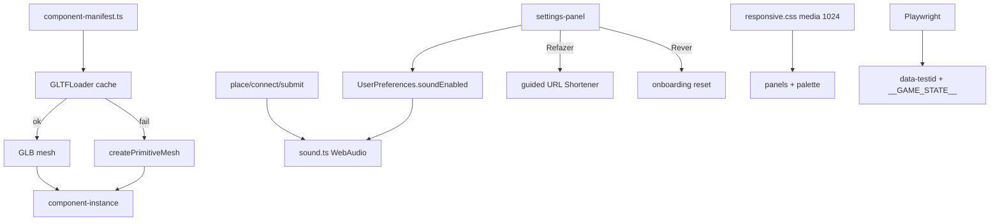

# Polish — Design

**Spec**: `.specs/features/polish/spec.md`  
**Context**: `.specs/features/polish/context.md`  
**Branch**: `feature/polish`  
**Status**: Approved (discuss 1A/2A/3/4A)

---

## Architecture Overview



Conformidade AD ativa:
- **AD-002/003** — Three.js vanilla + DOM UI
- **AD-004** — `ArchitectureGraph` inalterado
- **AD-009/017** — manifest GLB + fallback primitivo (Tier 4)
- **AD-010** — testes via hook; WebGL não em Vitest; e2e sem pixel assert
- **AD-011** — UI PT-BR
- **AD-012** — branch `feature/polish` → merge após verify

---

## Code Reuse Analysis

| Component | Location | How to Use |
| --------- | -------- | ---------- |
| Primitive mesh | `client/src/scene/component-instance.ts` | Extrair `createPrimitiveMesh`; fallback path |
| Component manager | `client/src/scene/component-manager.ts` | Continua `addComponent`; mesh source transparente |
| Preferences | `client/src/storage/preferences.ts` | Estender `soundEnabled`; reset helpers |
| Onboarding | `client/src/ui/onboarding.ts` | Reaproveitar mount após reset |
| Guided mode | `client/src/guided/guided-mode.ts` | Restart URL Shortener |
| Bootstrap | `client/src/bootstrap.ts` | Wire settings + routing |
| Catalog | `libs/shared` tier-2 (25) | Fonte de tipos para manifest |
| Game state | `client/src/test-hook.ts` | e2e + unit |

---

## Components

### `client/src/scene/component-manifest.ts`

```typescript
export interface ComponentAssetEntry {
  type: ComponentType;
  glbPath: string | null; // e.g. /assets/components/load-balancer.glb
}

export function getComponentManifest(): readonly ComponentAssetEntry[];
export function getGlbPath(type: ComponentType): string | null;
```

- Um entry por tipo em `TIER_2_TYPES` (25)
- Paths sob `client/public/assets/components/`
- Assets: GLBs mínimos CC0/gerados por **categoria** (reuso de mesh entre tipos da mesma categoria é OK se path por tipo aponta para arquivo existente)

### `client/src/scene/asset-loader.ts`

- `loadComponentModel(type): Promise<THREE.Object3D>`
- Cache por tipo; GLTFLoader; on failure → `null`
- `createComponentInstance` usa loader sync-or-async: MVP = resolve mesh async replace, ou sync primitivo primeiro + upgrade quando GLB chega (preferir: await no add path com timeout curto + fallback imediato primitivo se promise rejects)

**Chosen approach:** `createComponentInstance` starts with primitive; if `glbPath` set, kick off load and **replace mesh** in group on success (label preserved). Failure = keep primitive. Expose `meshSource: 'primitive' | 'glb'` on instance for tests via `__GAME_STATE__` optional field or instance userData.

### Sound — `client/src/audio/sound.ts`

```typescript
export type SoundId = 'place' | 'connect' | 'submit';
playSound(id: SoundId, opts?: { enabled?: boolean }): void;
```

- Oscillator + gain envelope (~80–150ms)
- No-op if `enabled === false` or AudioContext missing
- Wire from component place, edge create, submit click

### Settings — `client/src/ui/settings-panel.ts`

- Floating/modal button "Configurações"
- Toggle sons ↔ `savePreferences({ soundEnabled })`
- "Refazer tutorial" → `savePreferences({ guidedModeRequested: true, ... })` + `startGame` URL Shortener guided
- "Rever onboarding" → `savePreferences({ onboardingCompleted: false, ... })` + remount onboarding
- `data-testid="settings-panel"`

### Responsive — `client/src/ui/responsive.ts` + CSS

- Root class `sdq-layout--tablet` when `matchMedia('(max-width: 1024px)')`
- Palette: collapse toggle `data-testid="palette-collapse"`
- Stack briefing/requirements/panels via CSS flex/grid overrides

### e2e — `e2e/tutorial.spec.ts`

- Playwright config at repo root or `client/`
- Start preview/dev + mock `/api/judge*` 
- Flow: complete/skip onboarding beginner → guided place/connect → submit → result visible
- Assert `__GAME_STATE__.graph.nodes.length >= 1`

### SSH docs

- AGENTS.md: bullet "Remote Git: always SSH (`git@github.com:IEwerthonDev/system-design-quest.git`)"

---

## Data Models

```typescript
// preferences extension
interface UserPreferences {
  // ...existing
  soundEnabled: boolean; // default true
}
```

---

## Test Strategy

| Layer | Type | Notes |
| ----- | ---- | ----- |
| Manifest | unit | 25 entries, paths |
| Asset loader | unit | mock GLTFLoader success/fail → glb/primitive |
| Sound | unit | mock AudioContext; mute skip |
| Preferences | unit | soundEnabled + reset tutorial helpers |
| Settings panel | unit | jsdom clicks |
| Responsive | unit | applyLayoutForWidth(1024/1025) |
| e2e | Playwright | tutorial happy path |

Gate: `npx nx run-many -t lint test` + `npx playwright test` after e2e task.

---

## Risks & Concerns

| Concern | Mitigation |
| ------- | ---------- |
| GLB binaries large / hard to author | Minimal category GLBs; shared files OK |
| Async mesh replace races | Replace only if instance still mounted; ignore stale loads |
| Autoplay audio policy | Silent catch; first gesture unlock optional |
| Playwright + WebGL in CI | Don't assert canvas pixels; mock judge; allow WebGL optional |
| Settings mid-session wipe | Explicit restart of session on Refazer |

---

## AD Compliance

No supersede needed. Tier 4 delivered within AD-017 without expanding to 36 types (explicit out of scope).
