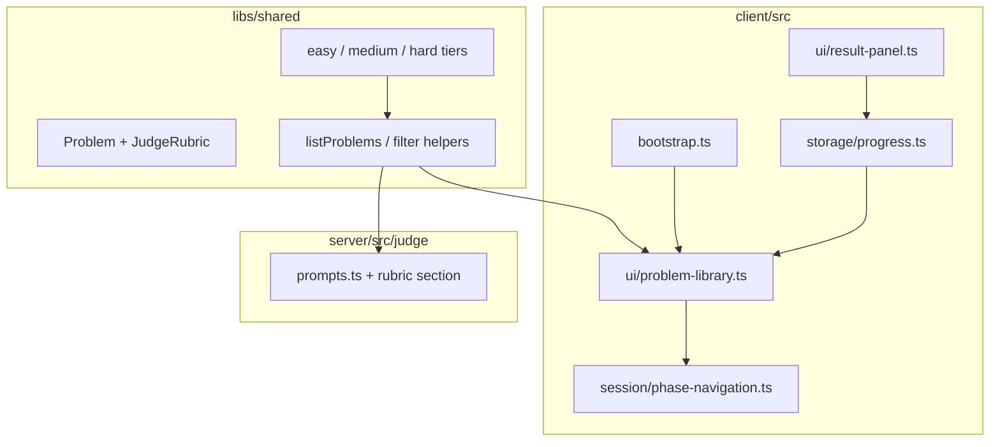

# Problem Library — Design

**Spec:** `.specs/features/problem-library/spec.md`  
**Status:** Approved — 2026-07-27

---

## Architecture Overview



---

## Data Models

### JudgeRubric (hidden)

```typescript
interface JudgeRubric {
  expectedComponents: string[];
  criticalPatterns: string[];
  commonMistakes: string[];
}
```

### Problem (extended)

```typescript
interface Problem {
  // existing fields...
  estimatedMinutes: { study: number; speedrun: number };
  rubric: JudgeRubric;
  isRecommended?: boolean;
}
```

### Progress (client localStorage)

```typescript
interface ProblemCompletion {
  problemId: string;
  verdict: Verdict;
  score: number;
  completedAt: string;
}

interface ProgressStore {
  completions: Record<string, ProblemCompletion>;
}
```

Key: `sdq-progress`

---

## Bootstrap Flow

| Condition | Entry |
| --------- | ----- |
| Onboarding not done | Onboarding → then below |
| `guidedModeRequested && !libraryUnlocked` | URL Shortener direct |
| else | Problem Library screen |

Library → select problem + mode → `mountPhaseNavigation({ problemId, mode })`

Back from briefing (future): library button in phase nav — out of scope; restart via page reload for now.

---

## Library UI

- Fixed overlay panel (same visual language as onboarding)
- Filter tabs: Todos · 🟢 Fácil · 🟡 Médio · 🔴 Difícil
- Grid of cards: title, difficulty, tags (max 3), ~N min Study, badges
- Footer: progress counters per tier
- Warning banner (inline, dismissible) on risky selections

Test hooks: `data-testid="problem-library"`, `problem-card-{id}`, `library-filter-{difficulty}`

---

## File Plan

| File | Purpose |
| ---- | ------- |
| `libs/shared/src/schema/problem.ts` | Extend types |
| `libs/shared/src/problems/easy.ts` | Easy tier (imports url-shortener) |
| `libs/shared/src/problems/medium.ts` | Medium tier |
| `libs/shared/src/problems/hard.ts` | Hard tier |
| `libs/shared/src/problems/registry.ts` | Filter/sort helpers |
| `libs/shared/src/problems/catalog.test.ts` | 27-count validation |
| `client/src/storage/progress.ts` | Completion tracking |
| `client/src/ui/problem-library.ts` | Library UI |
| `client/src/bootstrap.ts` | Route to library |
| `server/src/judge/prompts.ts` | Include rubric |
