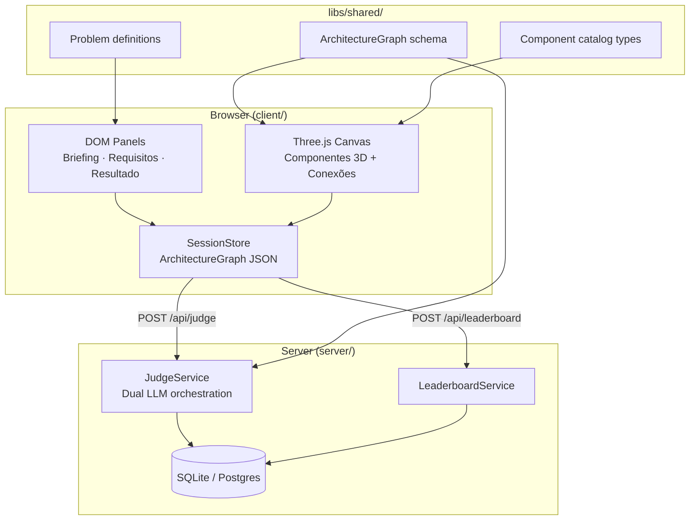
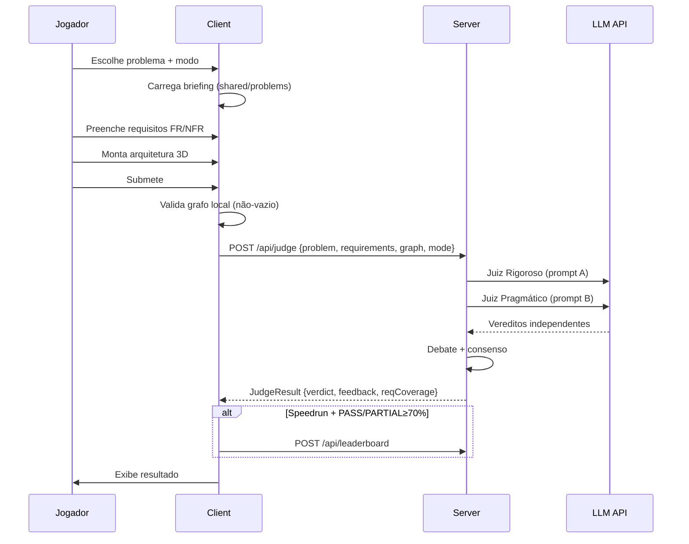

# System Design Quest — Architecture Design

**Spec:** `.specs/features/product/spec.md`  
**Context:** `.specs/features/product/context.md`  
**Status:** Draft — pending user approval

---

## Architecture Overview

Monorepo Nx com três pacotes: **client** (Three.js canvas + DOM UI), **server** (API de julgamento + ranking), **shared** (tipos, problemas, validação). O client mantém estado do diagrama em JSON serializável; o server orquestra juízes LLM e persiste rankings.



### Fluxo de uma sessão



---

## Approach Exploration

### Opção A — Monorepo Nx (Three.js vanilla + Express) ✅ Recomendada

| Prós | Contras |
| ---- | ------- |
| Padrão já conhecido (nj-mmo) | Setup inicial mais pesado que Vite single-app |
| `libs/shared` tipado end-to-end | Nx learning curve para novos contribuidores |
| Testes Vitest em todas as camadas | |
| CI com `nx affected` | |

### Opção B — Single Vite app + serverless functions

| Prós | Contras |
| ---- | ------- |
| Deploy simples (Vercel/Netlify) | LLM calls longas (>10s) problemáticas em serverless |
| Menos boilerplate | Sem shared lib tipada sem workarounds |

### Opção C — React + React Three Fiber

| Prós | Contras |
| ---- | ------- |
| Ecossistema React maduro | Re-renders podem afetar WebGL; nj-mmo provou vanilla funciona |
| Componentes declarativos | Curva de aprendizado R3F + performance em muitos nodes |

**Decisão:** Opção A — alinhada com AD-001 a AD-003 e experiência do usuário com nj-mmo.

---

## Code Reuse Analysis

### Patterns from nj-mmo to lift

| Pattern | nj-mmo location | Adaptation |
| ------- | --------------- | ---------- |
| `createRenderer()` + `startRenderLoop()` | `client/src/scene/renderer.ts` | Canvas isométrico, sem terreno/combat |
| Manifest-driven GLB loading | `client/src/scene/creature/player-manifest.ts` | `component-manifest.ts` com tipos de infra |
| `window.__GAME_STATE__` test hook | `client/src/test-hook.ts` | Expõe `ArchitectureGraph` para Vitest |
| Raycast input → intent | `client/src/input/click-to-move.ts` | Raycast para seleção/drag de componentes |
| Vite multi-page labs | `client/vite.config.ts` | `component-lab.html` para iterar ícones 3D |
| Spec-driven `.specs/` | `.specs/STATE.md` | Mesma estrutura TLC |

### Patterns from System Design Playground

| Pattern | Adaptation |
| ------- | ---------- |
| Problem library com tags/dificuldade | `libs/shared/src/problems/` |
| Dual AI judges + debate | `server/src/judge/dual-judge.ts` |
| Structured scoring rubric | `JudgeResult` type com seções fixas |

### Integration Points

| System | Method |
| ------ | ------ |
| LLM API | `server/src/judge/llm-client.ts` — OpenAI-compatible, streaming opcional |
| Database | Drizzle ORM + SQLite (dev) / Postgres (prod) |
| GitHub OAuth | `server/src/auth/github.ts` — opcional para ranking |

---

## Components

### Client — Scene (`client/src/scene/`)

- **Purpose:** Renderizar canvas 3D isométrico com componentes e conexões animadas
- **Location:** `client/src/scene/`
- **Interfaces:**
  - `createCanvasRenderer(canvas: HTMLCanvasElement): Promise<CanvasRenderer>`
  - `startRenderLoop(renderer: CanvasRenderer): () => void`
  - `addComponent(type: ComponentType, position: Vector3): ComponentInstance`
  - `connect(from: string, to: string, direction: 'forward' | 'bidirectional'): Edge`
  - `serializeGraph(): ArchitectureGraph`
  - `loadGraph(graph: ArchitectureGraph): void`
- **Dependencies:** Three.js, `@sdq/shared`
- **Reuses:** nj-mmo renderer pattern

### Client — Flow Shader (`client/src/scene/edges/flow-edge.ts`)

- **Purpose:** Renderizar conexões com animação de fluxo direcional
- **Location:** `client/src/scene/edges/flow-edge.ts`
- **Interfaces:**
  - `createFlowEdge(from: Vector3, to: Vector3, direction: EdgeDirection): THREE.Mesh`
  - `updateFlowAnimation(dt: number): void`
- **Implementation:** `TubeGeometry` + custom `ShaderMaterial` com `uTime` uniform; fragment shader desenha banda luminosa que se desloca ao longo do UV na direção da seta
- **Dependencies:** Three.js

### Client — UI Panels (`client/src/ui/`)

- **Purpose:** Painéis DOM para briefing, requisitos, paleta, propriedades, resultado
- **Location:** `client/src/ui/`
- **Interfaces:**
  - `mountBriefingPanel(problem: Problem): HTMLElement`
  - `mountRequirementsPanel(state: RequirementsState): HTMLElement`
  - `mountPalette(catalog: ComponentCatalog): HTMLElement`
  - `mountResultPanel(result: JudgeResult): HTMLElement`
- **Dependencies:** `@sdq/shared`, vanilla DOM

### Client — Session Store (`client/src/session/`)

- **Purpose:** Estado da sessão atual (fase, requisitos, grafo, timer)
- **Location:** `client/src/session/session-store.ts`
- **Interfaces:**
  - `createSession(problemId: string, mode: GameMode): Session`
  - `advancePhase(session: Session): void`
  - `getElapsedMs(session: Session): number`
- **Dependencies:** `@sdq/shared`

### Server — Judge Service (`server/src/judge/`)

- **Purpose:** Orquestrar dual-LLM judging com debate e consenso
- **Location:** `server/src/judge/`
- **Interfaces:**
  - `judgeSubmission(input: JudgeInput): Promise<JudgeResult>`
  - `validateLocal(graph: ArchitectureGraph): ValidationResult` — rejeita vazio antes de LLM
- **Dependencies:** LLM client, `@sdq/shared`

### Server — Leaderboard (`server/src/leaderboard/`)

- **Purpose:** Registrar e consultar rankings por categoria (problem_id)
- **Interfaces:**
  - `submitScore(entry: LeaderboardEntry): Promise<void>`
  - `getLeaderboard(problemId: string, limit: number): LeaderboardEntry[]`
- **Validation:** Só aceita se `verdict ∈ {PASS, PARTIAL}` e `score ≥ 70`

### Shared — Problem Definitions (`libs/shared/src/problems/`)

- **Purpose:** Definições tipadas de cada problema com briefing, rubrica e requisitos esperados (para o juiz, não visíveis ao jogador)
- **Interfaces:**
  - `getProblem(id: string): Problem`
  - `listProblems(filter?: ProblemFilter): ProblemSummary[]`

### Shared — Architecture Graph (`libs/shared/src/schema/`)

```typescript
interface ArchitectureGraph {
  nodes: ComponentNode[];
  edges: ConnectionEdge[];
}

interface ComponentNode {
  id: string;
  type: ComponentType;       // 'load_balancer' | 'redis_cache' | ...
  label: string;
  note?: string;
  position: { x: number; y: number; z: number };
}

interface ConnectionEdge {
  id: string;
  from: string;
  to: string;
  direction: 'forward' | 'bidirectional';
  label?: string;            // e.g. "HTTPS", "gRPC", "events"
}

interface JudgeResult {
  verdict: 'PASS' | 'PARTIAL' | 'FAIL';
  score: number;               // 0-100
  strengths: FeedbackItem[];
  criticalIssues: FeedbackItem[];
  improvements: FeedbackItem[];
  requirementCoverage: ReqCoverageItem[];
  judgeDebate: { rigorous: string; pragmatic: string; consensus: string };
}

interface FeedbackItem {
  title: string;
  explanation: string;
  howToImprove: string;
  whyItMatters: string;
  relatedComponents?: string[];  // node IDs
}
```

---

## Data Models

### Session (client-side, ephemeral)

```typescript
interface Session {
  id: string;
  problemId: string;
  mode: 'study' | 'speedrun';
  phase: 'briefing' | 'requirements' | 'canvas' | 'result';
  requirements: { functional: string[]; nonFunctional: string[] };
  graph: ArchitectureGraph;
  startedAt: number;
  submittedAt?: number;
}
```

### LeaderboardEntry (persisted)

```typescript
interface LeaderboardEntry {
  id: string;
  problemId: string;
  playerNickname: string;
  elapsedMs: number;
  score: number;
  verdict: 'PASS' | 'PARTIAL';
  createdAt: Date;
}
```

---

## Error Handling Strategy

| Error Scenario | Handling | User Impact |
| -------------- | -------- | ----------- |
| Canvas vazio no submit | Validação local, FAIL imediato | "Adicione pelo menos um componente" |
| LLM timeout (>60s) | Retry 1x, depois erro | "Julgamento demorou demais. Tente novamente." |
| LLM rate limit | Queue + backoff | "Muitas submissões. Aguarde 30s." |
| WebGL context lost | Recriar renderer | Canvas recarrega automaticamente |
| Ranking sem auth | Permitir nickname anônimo | Campo de nickname antes do speedrun |

---

## Risks & Concerns

| Concern | Impact | Mitigation |
| ------- | ------ | ---------- |
| Custo de LLM por submissão | Alto volume = $$ | Cache de designs idênticos; validação local pré-LLM; rate limit |
| Latência do julgamento (30-60s) | UX ruim | Loading com debate dos juízes em tempo real (streaming); skeleton UI |
| Qualidade inconsistente do LLM | Feedback errado prejudica aprendizado | Rubrica fixa no prompt; golden test submissions; score calibration |
| Performance 3D com muitos nodes | FPS drop | Instancing para componentes repetidos; LOD; culling |
| Assets 3D demorados de criar | Atraso no MVP | Primitivos Three.js no MVP; GLB iterativo via component-lab |

---

## Tech Decisions

| Decision | Choice | Rationale |
| -------- | ------ | --------- |
| Monorepo tool | Nx 23.x | Consistência com nj-mmo |
| 3D engine | Three.js 0.18x vanilla | Proven, full shader control |
| Build | Vite 8.x | Fast HMR para canvas dev |
| Server framework | Fastify | Leve, TypeScript-first, bom para streaming SSE |
| ORM | Drizzle | Mesmo do nj-mmo |
| Tests | Vitest + Playwright (visual gate) | Mesmo stack |
| CSS | CSS modules ou vanilla | Sem framework CSS pesado; minimalista |
| Font | Inter (Google Fonts) | Clean, legível, moderna |

> Decisões AD-001 a AD-012 registradas em `.specs/STATE.md`.
