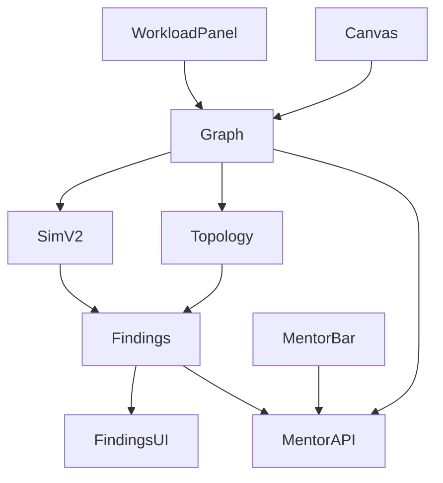

# Study Mode + Simulation Realism — Design

**Spec:** `.specs/features/study-mode/spec.md`  
**Status:** Approved (plan-locked)

---

## Architecture Overview



---

## Data model

### SimulationSettings (extends)

```ts
interface SimulationSettings {
  running: boolean
  speed: number          // 1–5 visual
  traffic: number        // 1–5 pedagogical
  readRatio: number      // 0–100
  // Absolute workload (optional; sandbox primary)
  rps?: number
  concurrentUsers?: number
  readRps?: number
  writeRps?: number
  avgObjectKb?: number
  avgResponseKb?: number
  networkLatencyMs?: number
  bandwidthMbps?: number
  targetAvailability?: number  // e.g. 99.9
  growthFactor?: number        // e.g. 10
  dailyDataGb?: number
}
```

`normalizeSimulation` clamps absolutes; if `readRps`/`writeRps` set, derives `readRatio = 100 * readRps / (readRps+writeRps)`.

### ArchitectureFinding

```ts
type FindingCode =
  | 'SPOF' | 'MISSING_CACHE' | 'MISSING_MQ' | 'NO_LB'
  | 'SINGLE_PRIMARY' | 'CACHE_OFF_PATH' | 'CONSISTENCY_RISK'
  | 'BOTTLENECK' | 'OVERPROVISION'

interface ArchitectureFinding {
  code: FindingCode
  severity: 'blocker' | 'major' | 'minor'
  nodeIds: string[]
  reasonPt: string
  reasonEn: string
}
```

### GameMode

`'study' | 'speedrun' | 'sandbox'`

`SANDBOX_PROBLEM_ID = '__sandbox__'`

### Mentor

```ts
type MentorAction = 'evaluate' | 'hint' | 'bottlenecks' | 'improve' | 'missing'

interface MentorInput {
  action: MentorAction
  graph: ArchitectureGraph
  findings?: ArchitectureFinding[]
  locale?: Locale
}

interface MentorResult {
  action: MentorAction
  title: string
  body: string
  relatedFindings?: FindingCode[]
}
```

---

## Simulation v2 formulas (AD-031)

| Symbol | Definition |
| ------ | ---------- |
| `BASE_RPS` | 200 (maps traffic=1) |
| `ingressRps` | If `readRps+writeRps > 0` → that sum; else if `rps > 0` → rps; else `BASE_RPS × traffic` |
| `readFrac` | `readRatio/100` (or derived) |
| Path load | BFS from `client_*` nodes; each hop receives fraction of parent load |
| Intent weight | `CACHE`→0.95 read, `DB`→0.35 read from app, `REQ`→0.5 (else type heuristic) |
| Cache pass | Downstream read load × `(1 − hitRate/100 × ttlFactor)` |
| Capacity | `replicas × CAPACITY_RPS[type] × modifiers` (RPS-calibrated; SQL base ~800) |
| Pressure | `ratio = load/capacity`; `<0.7` ok, `<1` warn, `≥1` hot |

Back-compat: graphs with only traffic/readRatio and no absolute fields produce the same relative pressure ordering as AD-020 for existing fixtures (tests assert levels, not absolute load numbers when using traffic-only).

---

## Topology rules (summary)

| Code | Trigger |
| ---- | ------- |
| SPOF | Critical type (`sql_db`,`nosql_db`,`cache_redis`,`load_balancer`,`app_server`) with replicas=1 and no redundant peer of same type |
| MISSING_CACHE | readFrac≥0.7 and path client→DB without cache/cdn |
| MISSING_MQ | write share≥0.4 (or writeRps high) and app→DB edge with no mq/kafka/worker in graph |
| NO_LB | ≥2 app/microservice replicas total without load_balancer/api_gateway |
| SINGLE_PRIMARY | DB primary RF≤1 and targetAvailability≥99.9 |
| CACHE_OFF_PATH | cache/cdn exists but not on any client→DB path |
| CONSISTENCY_RISK | SQL strong + RF>1 narrative / NoSQL consistency=one + targetAvailability≥99.9 |
| BOTTLENECK | pressure hot from sim |
| OVERPROVISION | ingressRps&lt;100 and ≥3 of {cdn,search,kafka} present |

---

## API

### `POST /api/mentor`

- Parse MentorInput; validate graph; rate-limit 20/IP/hour
- Compute findings server-side if omitted
- Mock if no `LLM_API_KEY` / `JUDGE_USE_MOCK`
- Else single LLM call with action-specific prompt + formatGraph + findings JSON
- Fastify route + `server/src/vercel/api-mentor.ts` → `api/mentor.js` via esbuild

---

## UI surfaces

| Surface | Behavior |
| ------- | -------- |
| Library CTA | Study Mode → sandbox session @ canvas |
| Problem buttons | Practice (`study`) + Speedrun |
| Workload panel | Sandbox only; absolute metric fields |
| Findings panel | Lists findings when sim running |
| Mentor bar | 5 buttons; result panel |
| Sim controls | Keep Start/Speed/Traffic/R-W for all modes; sandbox also has workload |

---

## Decisions to record

- **AD-031** — Sim v2 path propagation + absolute workload + topology findings; extends AD-020
- **AD-032** — `sandbox` GameMode = Study Mode freeform; `__sandbox__` sentinel
- **AD-033** — On-demand mentor API; sandbox-only chrome
